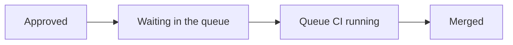

Most teams adopt a merge queue, watch main stop breaking, and stop measuring there. Then someone asks "is this thing actually making us faster, or did we just buy a bottleneck?" and nobody has the numbers.

This page covers what to measure, how to compute it from data you already have, and which numbers look meaningful but are not.

## Measure This Before You Turn It On

The single most common mistake is having no baseline. A merge queue changes where time is spent, so almost every metric moves. Without a "before", you cannot tell improvement from redistribution.

Record at least two weeks of:

| Baseline metric | How to get it |
|---|---|
| Merges per day on main | `git log --since` on the target branch, grouped by day |
| Time from approval to merge | PR review and merge timestamps from your forge API |
| Broken-main incidents per week | Post-merge CI failures on the target branch |
| Time to recover a broken main | First red post-merge run to first green one |
| CI runs per merged change | Total CI runs / merges, including re-runs and rebase re-runs |

That last row is the one teams forget, and it is the one that makes the queue look expensive later. Before a queue, every rebase-and-retry costs a CI run too. Those runs are usually invisible because they are attributed to the PR, not to the merge process.

## The Four Metrics That Matter

### 1. Time to merge

Time from "approved and ready" to "landed on main". Not from PR open, which mostly measures review latency and tells you nothing about the queue.

Break it into two parts, because they have different fixes:



- **Queue wait time** is high because throughput is too low. Fix with [batching](/features/batching/), [speculative checks](/features/speculative-merging/), or [parallel queues](/features/parallel-queues/).
- **Queue CI time** is high because your pipeline is slow. Fix the pipeline, or split it with [two-step CI](/features/two-step-ci/).

Tracking only the total hides which one is your problem. Track p50 and p95 separately: the p50 tells you the normal experience, the p95 tells you what people complain about.

### 2. Merge throughput

Changes successfully landed per day. This is the number that decides whether the queue can keep up with the team.

There is a hard ceiling, and it is worth computing:

```
max throughput ≈ (changes per CI run) × (parallel CI capacity) × (24h / CI duration)
```

A 30-minute pipeline, no batching, no speculation, gives you 48 merges/day at absolute best, and in practice much less. Batches of 4 take the same pipeline to ~192. If your team's arrival rate is anywhere near that ceiling, no amount of tuning saves you; you need to change the strategy.

### 3. Failure rate, split by cause

The percentage of queued changes that leave without merging. The aggregate number is nearly useless. The split is where the signal is:

| Cause | What it means | What to do |
|---|---|---|
| Real integration failure | The queue is doing its job. Each one is a broken main you did not have. | Nothing. Count these as saves. |
| [Flaky test](/glossary/#flaky-test) | Cost with no benefit. Ejects innocent changes, [bisects](/glossary/#bisection) for no reason. | See [Prerequisites](/decision/prerequisites/) |
| Merge conflict | The change sat too long before queueing. | Tighten [freshness policies](/features/freshness-policies/), shorten review cycles |
| Timeout / infra | CI capacity or reliability problem, not a code problem. | Capacity, not queue config |

A queue with a 12% failure rate that is 10% real integration failures is working beautifully. A queue with a 4% failure rate that is entirely flakes is burning money.

:::caution[Watch this one after every batch-size change]
Raising batch size raises the *observed* failure rate mechanically, because one bad change now fails a group. That is not a regression. Compare failures per merged change, not failures per CI run.
:::

### 4. CI cost per merged change

Total CI minutes divided by changes merged, over the same window.

This is the metric that keeps the finance conversation honest in both directions. A queue adds CI runs that did not exist before, and it removes rebase-retry runs that did. Only the ratio tells you the net.

Track it against your baseline, and expect the shape to depend on your strategy:

- Speculative, one run per change: cost per merge stays flat, latency drops.
- Batched: cost per merge falls with batch size, then rises again once [bisection](/glossary/#bisection) becomes frequent.

The inflection point is real and findable. When bisection runs exceed roughly one per day, your batch size has outgrown your test stability.

## The Outcome Metric

Everything above is instrumentation. This is the number the queue was bought for:

**Percentage of time the target branch is green.**

Sample post-merge CI status on main at a fixed interval, or reconstruct it from the run history. Before a queue, mature teams typically sit somewhere in the 90s and fight for each point. With a working queue, this should approach 100%, and the residual should be entirely non-integration causes: flaky post-merge tests, infrastructure, and deploy-time failures.

If it does not approach 100%, something is bypassing the queue. Look for direct pushes, admin merges, and the emergency-bypass path before you tune anything else.

## Mapping to DORA

If your organisation already reports DORA metrics, a merge queue moves three of the four, and it is worth being precise about how so nobody claims credit for the wrong thing.

| DORA metric | Effect | Why |
|---|---|---|
| Lead time for changes | Improves | Removes manual rebase-and-retry cycles from the tail |
| Deployment frequency | Improves | Main is deployable continuously instead of intermittently |
| Change failure rate | Improves | Integration failures are caught before landing, not after |
| Time to restore service | Roughly unchanged | The queue prevents broken *main*, not broken *production* |

Claiming the fourth is how a genuinely good result loses credibility. [Making the Case](/decision/making-the-case/) covers how to frame the rest of the argument.

## Numbers That Mislead

**Queue depth on its own.** A deep queue can mean CI is too slow, or it can mean the team shipped a lot today. Little's Law makes the relationship explicit:

```
average queue depth = arrival rate × average time in the queue
```

Depth rises when arrival rises, even if the queue got faster. Alert on *time in queue*, which is the thing engineers actually feel, and use depth as a diagnostic afterwards.

**Total CI minutes.** Always goes up after adoption, because work that used to be invisible retries is now explicit queue CI. Use cost per merged change instead.

**Individual queue position.** Interesting to the person waiting, meaningless as a team metric. It is a function of arrival order, not of anything you control.

**Merge queue "success rate" as a headline.** See the failure-rate split above. Optimising this number directly pushes teams toward smaller batches and less speculation, which is usually the wrong trade.

## A Minimal Dashboard

Six panels are enough for most teams:

1. Time to merge, p50 and p95, split into wait and CI
2. Merges per day, against the computed throughput ceiling
3. Failure rate, stacked by cause
4. CI minutes per merged change, against baseline
5. Percentage of time main is green
6. Bisections per day, if you batch

Everything on that list is derivable from forge webhooks and CI run history. You do not need a vendor to compute any of it, though most merge queue tools expose some of it directly.

## Review Cadence

- **Weekly:** failure rate by cause. It moves fastest and it is the earliest warning for test-suite rot.
- **Monthly:** time to merge, throughput headroom, cost per merged change. Retune batch size and speculation depth here, not weekly.
- **After any pipeline change:** re-derive the throughput ceiling. A pipeline that grew from 20 to 35 minutes quietly cut your maximum merge rate by 40%.

## Next Steps

- [Prerequisites](/decision/prerequisites/) - the flake-rate threshold these metrics keep bumping into
- [Making the Case](/decision/making-the-case/) - turning these numbers into an argument
- [Batching](/features/batching/) - the main cost/latency dial
- [Speculative Checks](/features/speculative-merging/) - the main latency dial
- [Glossary](/glossary/#metrics) - definitions for the terms above
