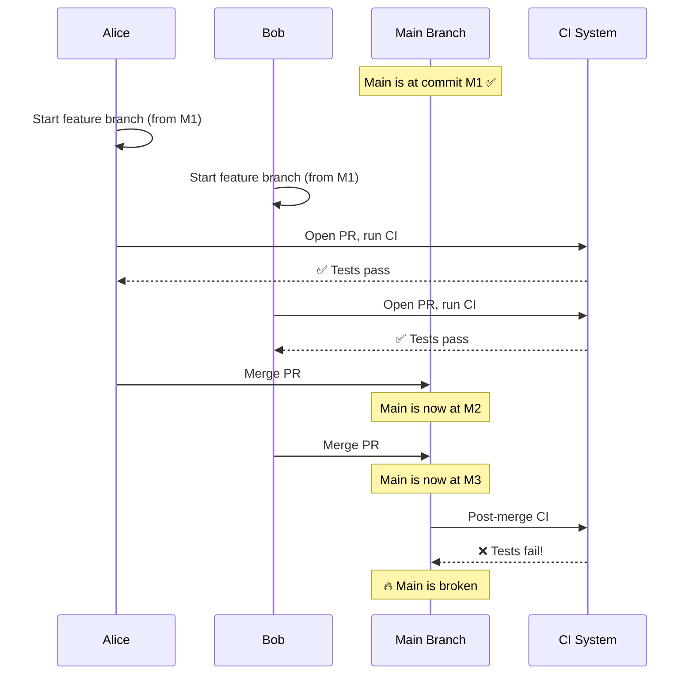
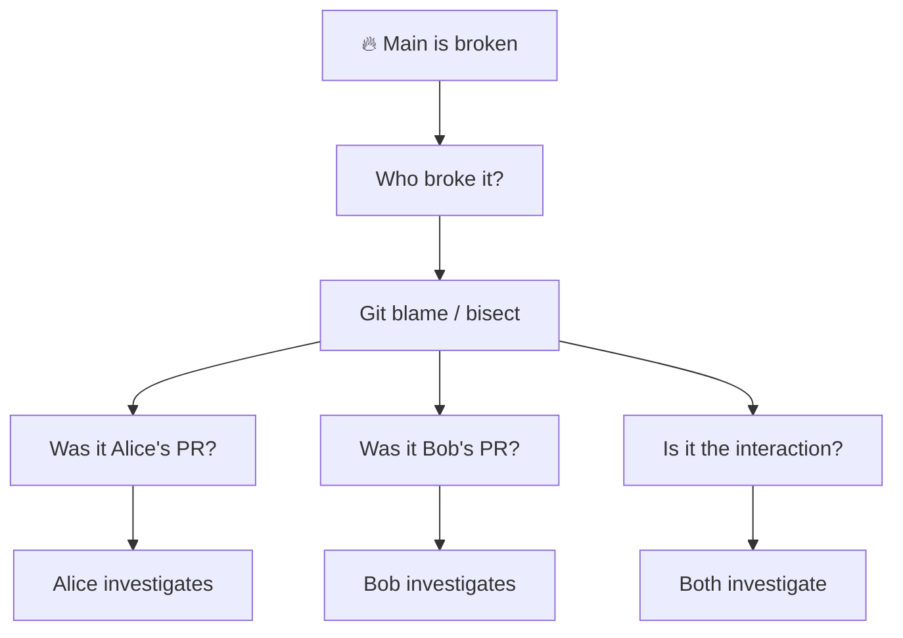
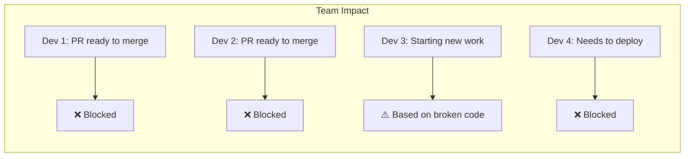
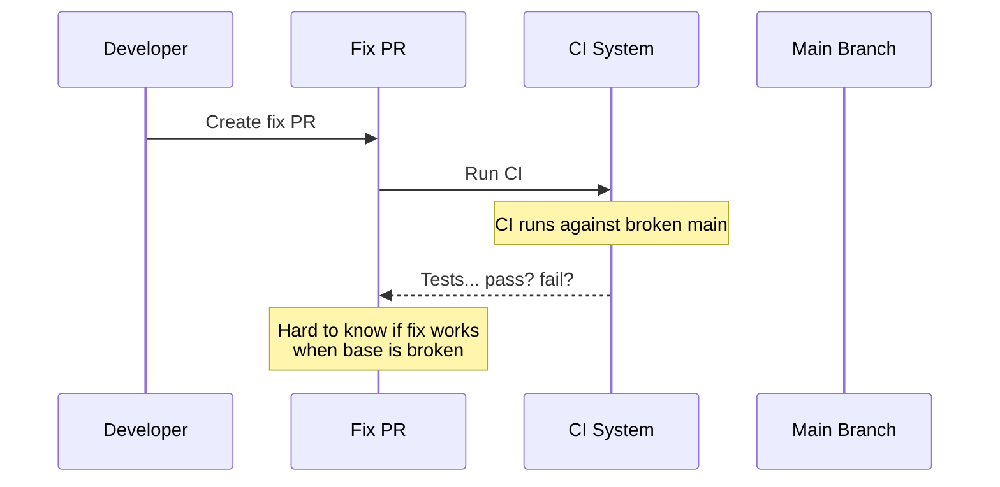
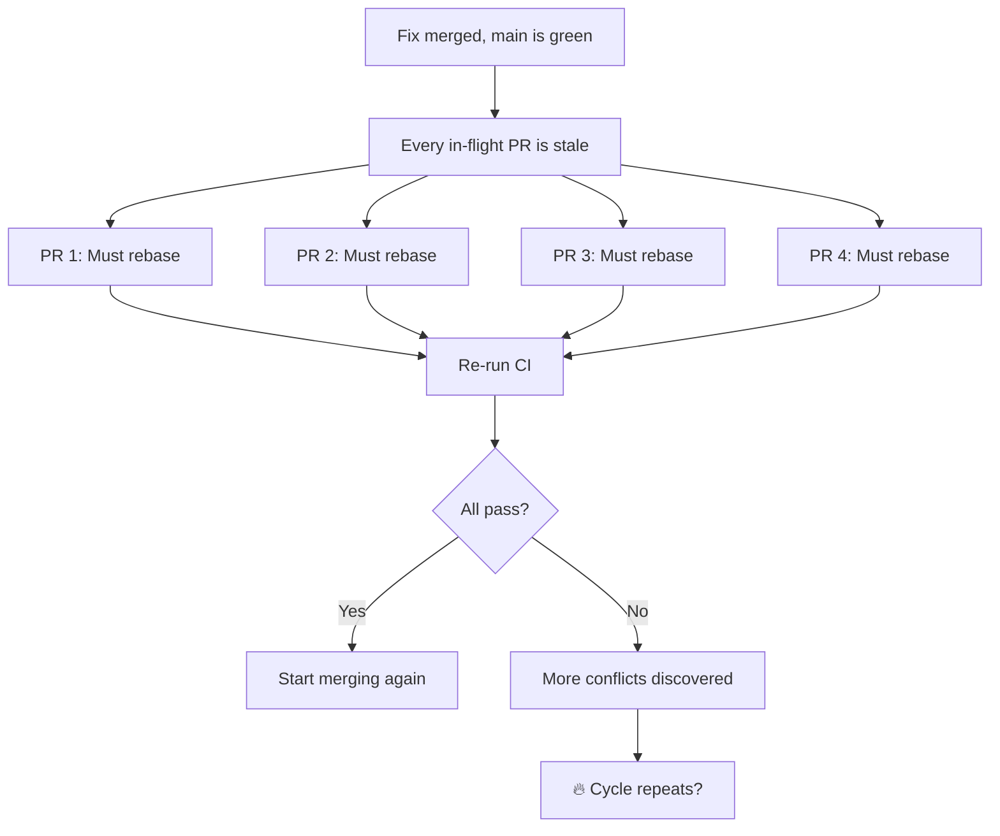
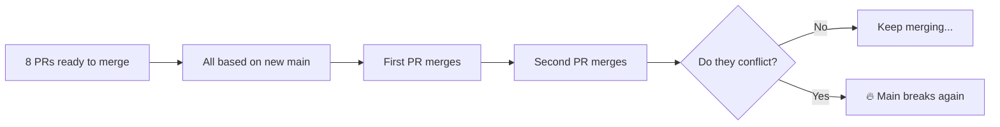
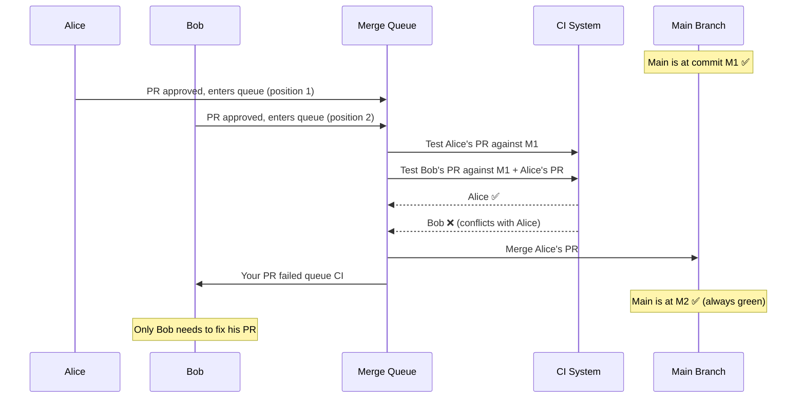

When main breaks, failures cascade. This page shows what happens and why the costs exceed what most teams expect.

## The Anatomy of a Broken Main

Two developers, Alice and Bob, work on separate features.



Both PRs were tested against M1 and passed. But Alice's changes (M2) and Bob's changes (M3) conflict in ways that neither CI run could detect. Now main is broken.

### A Concrete Example

Your codebase has a utility module:

```python
# utils.py
def calculate_tax(amount):
    return amount * 0.2
```

**Alice** is refactoring. She renames `utils.py` to `helpers.py` and updates all existing imports:

```python
# helpers.py (renamed from utils.py)
def calculate_tax(amount):
    return amount * 0.2
```

**Bob** is building a new feature. He adds code that imports from `utils`:

```python
# checkout.py (new file)
from utils import calculate_tax

def process_order(total):
    tax = calculate_tax(total)
    return total + tax
```

Both PRs pass CI:
- Alice's PR: All tests pass—she updated every import
- Bob's PR: All tests pass—`utils.py` still exists on his branch

There's no merge conflict—they touched different files. Git happily merges both.

But now `checkout.py` imports from `utils`, which no longer exists. **Main is broken.**

```
ModuleNotFoundError: No module named 'utils'
```

This pattern repeats with renamed functions, deleted code, changed signatures, and modified configuration. No merge conflict to warn you—just broken code on main.

## The Cascade Begins

### Stage 1: Discovery (Minutes to Hours)

Someone notices main is broken. Maybe it's the post-merge CI. Maybe it's a developer who just pulled latest. Maybe it's a failed deployment.



**Time lost:** 15 minutes to several hours, depending on how obvious the failure is.

### Stage 2: Blocked Developers

While main is broken:



- **Developers with ready PRs** can't merge—the policy is "don't merge to a broken main"
- **Developers starting new work** base their branches on broken code
- **Deployments are blocked** until main is fixed
- **Hotfixes become complex** because you can't deploy the fix without also deploying the broken code

**Cost:** If you have 10 developers and main is broken for 2 hours, that's 20 developer-hours of disruption.

### Stage 3: The Fix

Someone identifies the problem and creates a fix PR.



**Problem:** It's hard to verify the fix works because CI is running against broken main. You might:
- Think you fixed it, but you didn't
- Fix one issue but introduce another
- Have to iterate multiple times

**Time lost:** 30 minutes to several hours for the fix itself.

### Stage 4: The Rebase Avalanche

The fix lands. Main is green again. But now:



Every developer with an in-flight PR must:
1. Rebase onto the fixed main
2. Resolve any conflicts with the fix
3. Re-run CI
4. Wait in line to merge again

**Cost:** If 8 PRs were in flight, and each rebase + CI takes 30 minutes, that's 4 hours of additional wait time across the team.

### Stage 5: The Risk of Recurrence

The worst part: the same conditions that caused the break still exist.



Without a merge queue, you're right back where you started. The PRs were rebased, but they were only tested individually, not against each other. The cycle can repeat.

## The Hidden Costs

### Developer Context Switching

Every time a developer is blocked, they have to:
1. Stop what they're doing
2. Investigate or wait
3. Resume their original work (losing context)

[Research by Gloria Mark at UC Irvine](https://www.ics.uci.edu/~gmark/chi08-mark.pdf) shows it takes **23 minutes** to regain focus after an interruption. A broken main interrupts everyone.

### Compound Delays

If main breaks once per week and takes 2 hours to fix, the direct cost is 2 hours. But the indirect cost is:
- 2 hours × N developers blocked
- Time to rebase all in-flight PRs
- CI resources wasted on broken runs
- Deployment delays
- Possible customer impact if caught in a release cycle

### Trust Erosion

Teams that experience frequent broken mains develop defensive behaviors:
- Hesitation to merge ("let someone else go first")
- Over-reliance on manual testing
- Slower release cycles
- Reduced confidence in CI

## How a Merge Queue Prevents This

With a merge queue:



The queue catches the conflict **before** it breaks main. Alice's changes land. Bob gets notified. Main stays green. No one else is affected.

## Summary

| Without Merge Queue | With Merge Queue |
|---------------------|------------------|
| Main can break | Main cannot break |
| Everyone is blocked | Only failing PR author is affected |
| Cascading rebases | No rebases needed |
| CI waste on broken main | CI only runs on valid states |
| Trust erodes over time | Confidence in main stays high |
| Cycle can repeat | Problem is contained |

The cost of a broken main is not the time to fix it—it's the compound disruption across your team. A merge queue eliminates this class of problem.
