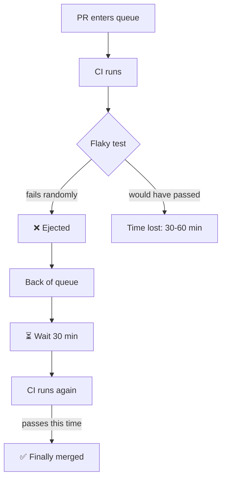

A merge queue is not a silver bullet. It amplifies your existing CI practices—both the good and the bad. If your tests are flaky, the queue will surface that pain constantly. If your CI is slow, the queue becomes a bottleneck.

Fix these issues first, or the merge queue will be more frustrating than helpful.

## Flaky Tests

This is the most critical prerequisite. A flaky test is one that sometimes passes and sometimes fails for the same code.



**The math is brutal:**
- A 5% flake rate means 1 in 20 test runs fails randomly
- With 20 PRs/day, that's 1 false failure every single day
- With batching, a flake fails the entire batch—ejecting innocent PRs

**With a merge queue**, flaky tests cause:
- PRs ejected from the queue for no real reason
- Developers re-queuing and waiting again
- Lost trust in the system ("the queue is broken")
- Wasted CI resources on retries

### Target: <2% flake rate

Before adopting a merge queue, your test suite should have a flake rate under 2%. That means fewer than 1 in 50 runs fails randomly.

### How to measure

Run your test suite 100+ times on the same commit. Count failures.

```bash
# Simple approach: run tests N times, count failures
for i in {1..100}; do
  npm test > /dev/null 2>&1 || echo "FAIL"
done | grep -c FAIL
```

If you see more than 2 failures in 100 runs, you have work to do.

### How to fix

1. **Quarantine flaky tests** — Move them to a separate suite that doesn't block merges
2. **Fix the root cause** — Usually: timing issues, shared state, or external dependencies
3. **Delete tests that can't be fixed** — A test that fails randomly provides negative value

---

## CI Reliability

A merge queue trusts your CI completely. If CI says "pass," the PR merges. If CI says "fail," the PR is ejected. There's no human in the loop second-guessing the result.

This means CI must give a reliable signal. When CI fails, it should mean the code is actually broken—not that a runner crashed or the network hiccuped.

**Problems to fix:**
- Runners that crash or timeout randomly
- Network issues causing spurious failures
- Resource contention (out of memory, disk full)
- Non-deterministic builds (different results for same code)

### Target: >99% infrastructure reliability

CI failures should almost always be real test failures, not infrastructure problems.

### Red flags

- "CI was flaky, re-running" is a common phrase on your team
- Developers retry failed jobs without looking at logs
- Same test passes on retry without code changes
- CI failures correlate with time of day (resource contention)

---

## CI Speed

CI speed matters because of the **feedback loop**. When a PR fails in the queue, the developer needs to know quickly so they can fix it and re-queue. A 45-minute CI means 45 minutes of waiting before learning something went wrong—then another 45 minutes after the fix.

### Ideal: <20 minutes

Under 20 minutes keeps the feedback loop tight. Developers can fix issues and re-queue within the same focus session.

But not everyone can achieve this—and that's okay. If your CI is slower, merge queue features can help:

- **[Batching](/features/batching/)** — Test multiple PRs together, amortizing CI time across the batch
- **[Two-step CI](/features/two-step-ci/)** — Run fast checks on PRs, full suite only in the queue
- **[Speculative merging](/features/speculative-merging/)** — Test PRs in parallel, assuming earlier ones will pass
- **[Parallel queues](/features/parallel-queues/)** — Separate queues for independent parts of the codebase

### The real question

Can your developers get feedback and iterate within a reasonable time? If a PR takes 3 CI cycles to merge (common for complex changes), that's 3× your CI duration in wait time. Make sure that's acceptable for your team.

---

## Test Coverage

A merge queue validates that tests pass—nothing more. If your tests don't catch bugs, the queue won't either.

**Merge queue guarantees:**
- ✅ Tests that exist will pass on main
- ❌ Bugs not covered by tests will still reach main

### Minimum bar

Before adopting a merge queue, ensure:
- Critical user paths have integration tests
- Core business logic has unit tests
- API contracts are tested
- Database migrations are tested

### Warning sign

If you frequently hear "tests passed but the feature is broken," your test coverage is the problem—not your merge process.

---

## Readiness Checklist

| Prerequisite | Target | How to Measure |
|--------------|--------|----------------|
| Flaky test rate | <2% | Run tests 100x on same commit |
| CI reliability | >99% | Track infra failures vs test failures |
| CI duration | <20 min ideal | Average pipeline run time |
| Test coverage | Critical paths covered | Code review, coverage reports |

---

## What If You're Not Ready?

If you don't meet these prerequisites, you have options:

### Fix flaky tests first
This is almost always the right answer. Flaky tests hurt you with or without a merge queue—the queue just makes the pain visible.

### Start with a subset
Some merge queue tools let you enable the queue for specific paths or teams. Start with the most stable part of your codebase.

### Use "dry run" mode
Some tools offer a mode where the queue runs but doesn't block merges. Use this to measure your flake rate and CI reliability before committing.

### Optimize CI in parallel
You can work on CI speed while fixing flaky tests. Both improvements pay off independently.

---

## Next Steps

Once you meet these prerequisites:
- [When to Skip It](/decision/when-to-skip-it/) — Make sure a merge queue is right for your situation
- [Making the Case](/decision/making-the-case/) — Convince your team or leadership
