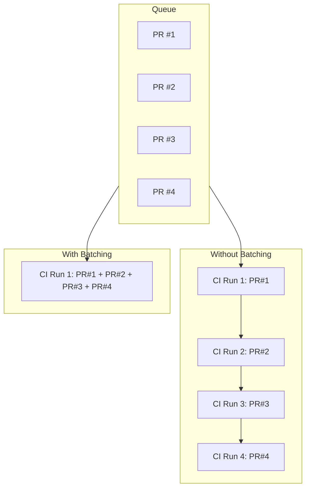

When CI takes 30 minutes and you have 10 PRs waiting, sequential testing would take 5 hours. Batching groups multiple PRs into a single CI run:



## How It Works

1. Multiple PRs enter the queue
2. The merge queue combines them into a single test branch
3. CI runs once against the combined changes
4. If it passes, all PRs merge together

## Handling Failures

If the batch fails, the merge queue needs to identify which PR caused the failure. Common strategies:

### Binary Search

Split the batch in half and test each half. Continue splitting until the failing PR is found.

```
Batch [1,2,3,4] fails
  → Test [1,2] and [3,4]
  → [1,2] passes, [3,4] fails
  → Test [3] and [4]
  → [3] fails → Remove PR #3
```

### Optimistic Retry

Remove the most recently added PR and retry. Fast but may remove innocent PRs.

### Full Bisection

Test each PR individually. Slowest but guarantees finding all failures.

## Configuration Options

| Setting | Description |
|---------|-------------|
| **Batch size** | Maximum PRs per batch (e.g., 5, 10, unlimited) |
| **Batch window** | Time to wait for more PRs before starting CI |
| **Failure strategy** | How to identify failing PRs (binary search, etc.) |

## Trade-offs

**Pros:**
- Dramatically reduces total CI time
- More efficient resource usage
- Faster time-to-merge for most PRs

**Cons:**
- One failure affects the whole batch
- Bisection adds latency when failures occur
- May need larger CI runners for combined changes
