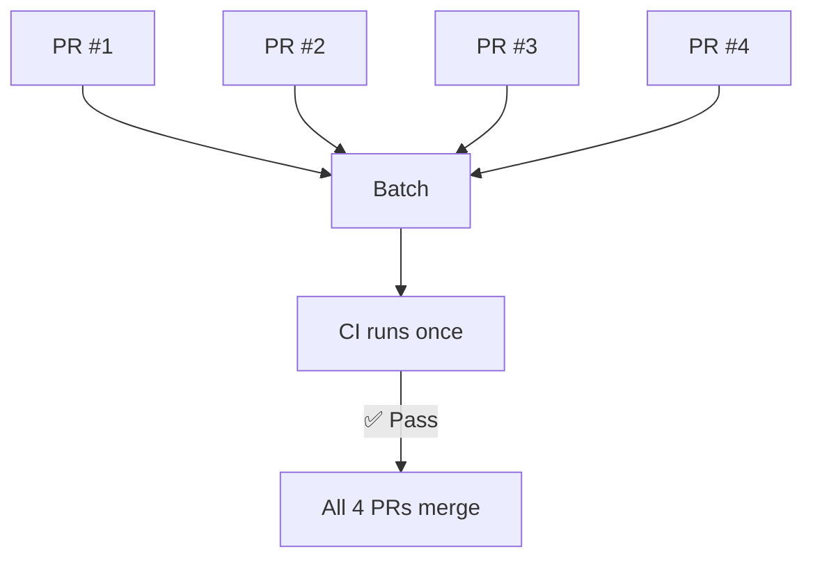

Testing each PR individually means one CI run per PR. With 10 PRs, that's 10 CI runs. Batching groups multiple PRs into a single CI run, dramatically cutting CI cost and resource usage.

| | Without Batching | With Batching |
|---|---|---|
| **PRs** | 4 | 4 |
| **CI runs** | 4 | 1 |
| **Cost** | 4x | 1x |



## How It Works

1. Multiple PRs enter the queue
2. The merge queue combines them into a single test branch
3. CI runs once against the combined changes
4. If it passes, all PRs merge together

## Handling Failures

If the batch fails, the merge queue needs to identify which PR caused the failure. Common strategies:

### Speculative Bisection

Test overlapping subsets in parallel. This allows partial merges while identifying failures.

```
Batch [1,2,3,4] fails
  → Test [1,2] and [1,2,3] in parallel
  → [1,2] passes → merge PR #1 and #2
  → [1,2,3] fails → PR #3 is the problem
  → Remove PR #3
  → Put PR #4 back in queue
```

## In Practice

Consider a team merging 20 PRs per day with a 30-minute CI pipeline:

- **Without batching:** 20 CI runs × 30 min = 10 hours of CI time
- **With batches of 4:** 5 CI runs × 30 min = 2.5 hours of CI time

That's a 75% reduction in CI resource usage. For teams paying for CI by the minute, this directly reduces infrastructure costs.

The trade-off appears when a batch fails. If batch [1,2,3,4] fails, bisection adds 1-2 extra CI runs to isolate the culprit. But with a healthy codebase (failure rate under 5%), the savings far outweigh the occasional bisection cost.

## Choosing Your Batch Size

The right batch size depends on your failure rate and CI duration:

- **Low failure rate (<2%)** — larger batches (5-10 PRs) work well since bisection is rare
- **Medium failure rate (2-5%)** — moderate batches (3-5 PRs) balance efficiency and recovery time
- **High failure rate (>5%)** — small batches (2-3 PRs), or invest in fixing your flaky tests first

A useful rule of thumb: if bisection happens more than once per day, your batch size is too large or your test stability needs work.

## Configuration Options

| Setting | Description |
|---------|-------------|
| **Batch size** | Maximum PRs per batch (e.g., 5, 10, unlimited) |
| **Batch wait time** | Time to wait for more PRs before starting CI |

## Combining with Speculative Checks

Batching and [speculative checks](/features/speculative-merging/) are complementary strategies that can be used together:

:::tip[Best of both worlds]
- **Batching** reduces CI cost by testing multiple PRs per run
- **Speculative checks** reduce latency by testing batches in parallel

A queue might test batch [1-3] while speculatively testing batch [4-6], achieving both efficiency and speed.
:::

## Trade-offs

**Pros:**
- Dramatically reduces CI cost and resource usage
- Fewer CI runs means less infrastructure load
- Combines well with speculative checks for both speed and efficiency

**Cons:**
- One failure affects the whole batch
- Bisection adds latency when failures occur
- May need larger CI runners for combined changes

## Related Features

- **[Speculative Checks](/features/speculative-merging/)** — test batches in parallel for maximum throughput
- **[Two-Step CI](/features/two-step-ci/)** — ensure PRs pass lightweight checks before entering a batch
- **[Priority Management](/features/priority-management/)** — urgent PRs can bypass batch waiting
