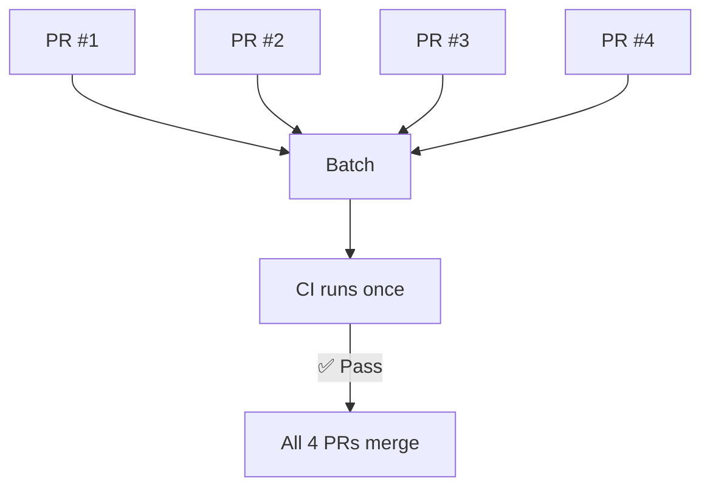

Testing each PR individually means one CI run per PR. With 10 PRs, that's 10 CI runs. Batching groups multiple PRs into a single CI run, dramatically cutting CI cost and resource usage.

| | Without Batching | With Batching |
|---|---|---|
| **PRs** | 4 | 4 |
| **CI runs** | 4 | 1 |
| **Cost** | 4x | 1x |



## How It Works

1. Multiple PRs enter the queue
2. The merge queue combines them into a single test branch
3. CI runs once against the combined changes
4. If it passes, all PRs merge together

## Handling Failures

If the batch fails, the merge queue needs to identify which PR caused the failure. Common strategies:

### Speculative Bisection

Test overlapping subsets in parallel. This allows partial merges while identifying failures.

```
Batch [1,2,3,4] fails
  → Test [1,2] and [1,2,3] in parallel
  → [1,2] passes → merge PR #1 and #2
  → [1,2,3] fails → PR #3 is the problem
  → Remove PR #3
  → Put PR #4 back in queue
```

## Configuration Options

| Setting | Description |
|---------|-------------|
| **Batch size** | Maximum PRs per batch (e.g., 5, 10, unlimited) |
| **Batch wait time** | Time to wait for more PRs before starting CI |

## Trade-offs

**Pros:**
- Dramatically reduces CI cost and resource usage
- Fewer CI runs means less infrastructure load
- Works well with [speculative merging](/features/speculative-merging/) for both speed and efficiency

**Cons:**
- One failure affects the whole batch
- Bisection adds latency when failures occur
- May need larger CI runners for combined changes
