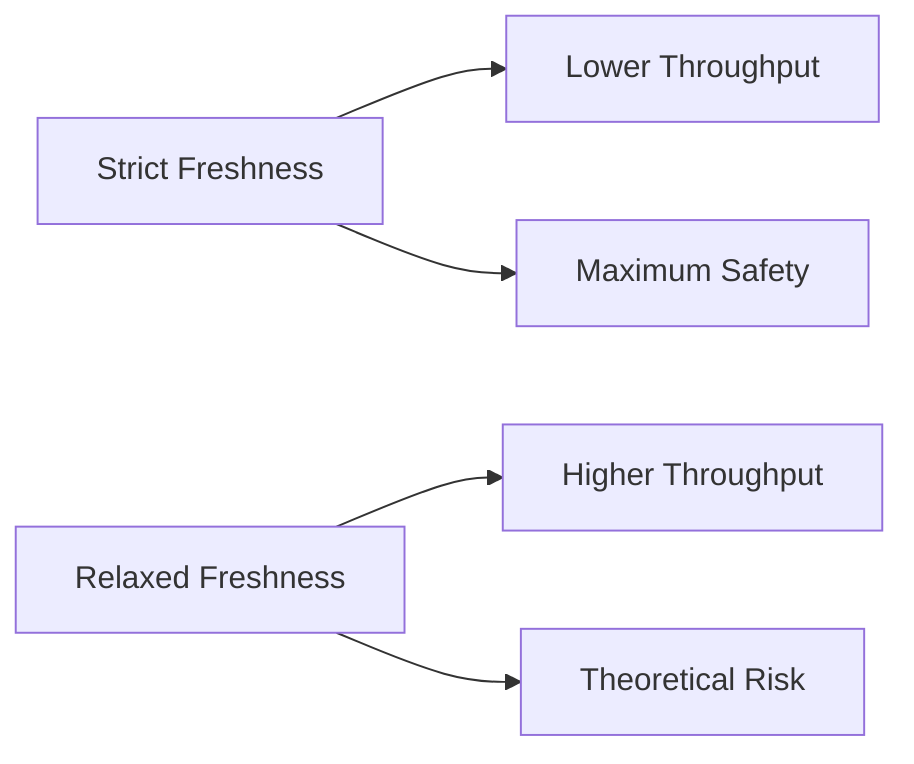

The strictest policy requires every PR to be tested against the **exact current state of main**. But this isn't always necessary.

## Freshness Options

| Freshness Policy | Description | Use Case |
|-----------------|-------------|----------|
| **Strict** | Must be tested against current HEAD | Critical systems, regulated industries |
| **Within N commits** | Can be up to N commits behind | Balance between safety and throughput |
| **Within scope** | Only up-to-date within its partition | Monorepos with independent components |
| **Time-based** | Valid for N minutes after queue CI passes | High-velocity teams with fast CI |

## Why Relax Freshness?

Strict freshness means every merge invalidates all in-flight queue tests. With high PR volume, this creates a race condition where PRs struggle to merge.

**Example:**
- PR #1 passes queue CI at 10:00
- PR #2 merges at 10:01
- PR #1's test is now "stale" and must re-run

With relaxed freshness (e.g., "within 2 commits"), PR #1 can still merge if it's only 1 commit behind.

## Risk vs Throughput

**The risk is usually theoretical** because:
- Most PRs don't conflict semantically
- Type systems catch many integration issues
- Runtime failures are rare for unrelated changes

## Choosing a Policy

| Team Profile | Recommended Policy |
|--------------|-------------------|
| Regulated/compliance | Strict |
| High-velocity startup | Time-based (5-10 min) |
| Monorepo with scopes | Within scope |
| Medium velocity | Within 2-3 commits |

## Combining with Other Features

Freshness policies work well with:
- **[Parallel Queues](/features/parallel-queues/)** - per-scope freshness
- **[Speculative Checks](/features/speculative-merging/)** - reduce re-testing
- **[Batching](/features/batching/)** - merge multiple PRs atomically
