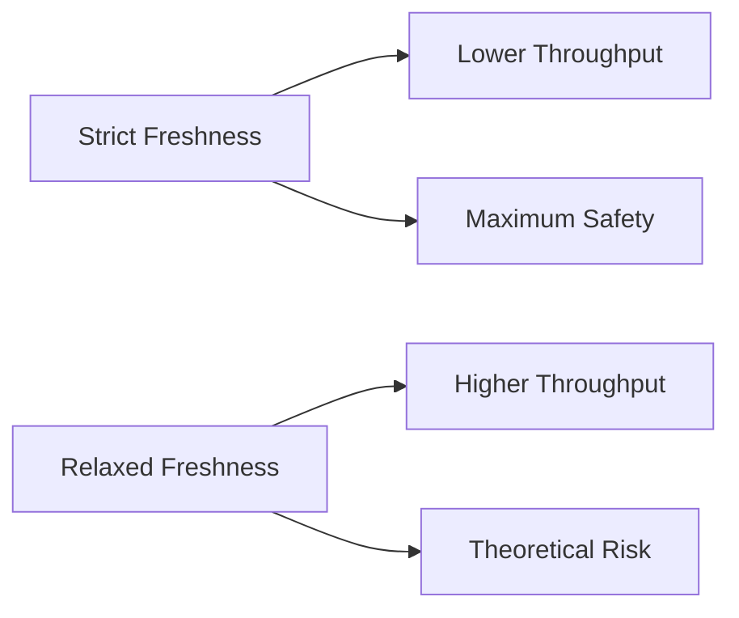

The strictest policy requires every PR to be tested against the **exact current state of main**. But this isn't always necessary.

## Freshness Options

| Freshness Policy | Description | Use Case |
|-----------------|-------------|----------|
| **Strict** | Must be tested against current HEAD | Critical systems, regulated industries |
| **Within N commits** | Can be up to N commits behind | Balance between safety and throughput |
| **Within scope** | Only up-to-date within its partition | Monorepos with independent components |
| **Time-based** | Valid for N minutes after queue CI passes | High-velocity teams with fast CI |

## Why Relax Freshness?

Strict freshness means every merge invalidates all in-flight queue tests. With high PR volume, this creates a race condition where PRs struggle to merge.

**Example:**
- PR #1 passes queue CI at 10:00
- PR #2 merges at 10:01
- PR #1's test is now "stale" and must re-run

With relaxed freshness (e.g., "within 2 commits"), PR #1 can still merge if it's only 1 commit behind.

## Risk vs Throughput

**The risk is usually theoretical** because:
- Most PRs don't conflict semantically
- Type systems catch many integration issues
- Runtime failures are rare for unrelated changes

## Choosing a Policy

| Team Profile | Recommended Policy |
|--------------|-------------------|
| Regulated/compliance | Strict |
| High-velocity startup | Time-based (5-10 min) |
| Monorepo with scopes | Within scope |
| Medium velocity | Within 2-3 commits |

## Strict Freshness Under Load

Consider a team merging 30 PRs per day with a 15-minute CI pipeline.

With strict freshness, every merge invalidates all in-flight tests. If 3 PRs are testing and one merges, the other 2 must restart. During peak hours, PRs can cycle through 3-4 restarts before finally merging — turning a 15-minute pipeline into a 60-minute wait.

The math is unforgiving:

| PRs in queue | Avg restarts per PR (strict) | Effective merge time |
|---|---|---|
| 2 | 0.5 | ~22 min |
| 5 | 1.5 | ~37 min |
| 10 | 3+ | ~60+ min |

Relaxing freshness to "within 2 commits" eliminates most restarts while maintaining strong safety guarantees. The probability of a semantic conflict between two unrelated PRs is typically well under 1%.

## Per-Scope Freshness

When using [parallel queues](/features/parallel-queues/), freshness can be applied per scope. A frontend PR only needs to be fresh relative to other frontend changes — a backend merge doesn't invalidate it.

This is the most powerful freshness optimization for monorepos. It combines the safety of strict freshness within each domain with the throughput of relaxed policies across domains.

## Related Features

- **[Parallel Queues](/features/parallel-queues/)** — per-scope freshness for monorepos
- **[Speculative Checks](/features/speculative-merging/)** — reduce the impact of restarts from freshness invalidation
- **[Batching](/features/batching/)** — atomic batch merges count as a single freshness event

See also: [High-Velocity Teams](/use-cases/high-velocity-teams/) for guidance on choosing freshness policies at scale.
