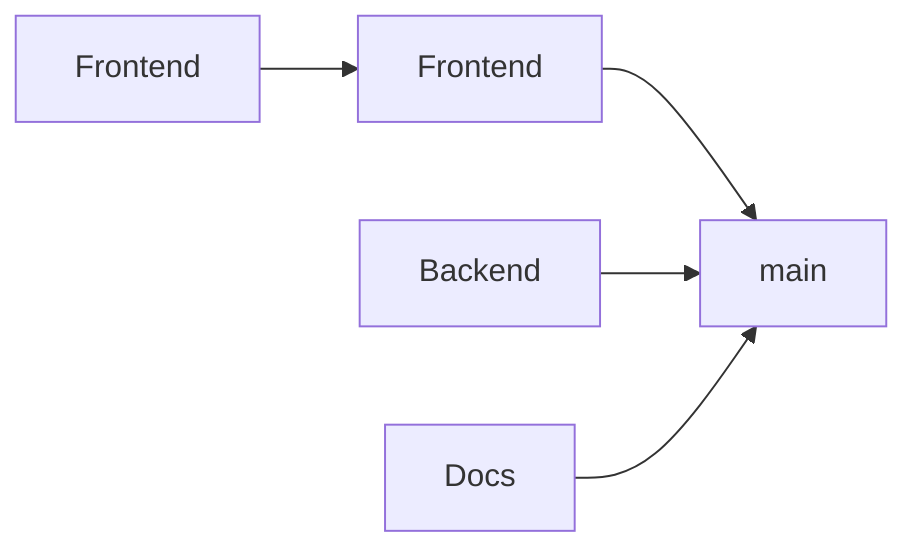

Not all changes conflict with each other. A frontend CSS change and a backend API change can often be tested and merged independently. **Parallel queues** (sometimes called "partitions" or "scopes") allow this:

**Single queue:** all PRs wait in one line, even if they don't conflict.

**Parallel queues:** independent scopes merge simultaneously.

## How It Works

With parallel queues:
- PRs in the **same scope** are tested against each other (strict ordering)
- PRs in **different scopes** can merge independently (parallel)
- You define scopes based on your codebase (by directory, by team, by project)

This dramatically increases throughput for large monorepos where most changes don't interact.

## In Practice

Consider a monorepo with three teams: Frontend, Backend, and Platform.

Without parallel queues, all 30 daily PRs wait in a single queue. With a 20-minute CI pipeline, a serial queue processes ~24 PRs per 8-hour day. At 30 PRs/day, the queue falls behind.

With parallel queues scoped by directory:

| Scope | PRs/day | Queue capacity | Status |
|-------|---------|----------------|--------|
| `src/frontend/` | 12 | 24/day | Comfortable |
| `src/backend/` | 15 | 24/day | Comfortable |
| `src/platform/` | 3 | 24/day | Nearly empty |

Each scope operates independently. Combined throughput is 72 PRs/day — 3x the single-queue capacity. Teams merge at their own pace without blocking each other.

## Defining Scopes

Common approaches to defining parallel queues:

- **By directory** — group by file paths (`src/frontend/`, `src/backend/`, `docs/`)
- **By team** — each team owns their scope and merge pace
- **By build target** — particularly useful with monorepo build tools like Bazel, Rush, Nx, Turborepo, or Pants that understand dependency graphs

## Handling Cross-Scope Changes

What happens when a PR touches multiple scopes?

| Strategy | Behavior |
|----------|----------|
| **Union** | PR joins all affected queues, must pass all |
| **Primary scope** | PR joins only its primary/largest scope |
| **Global queue** | Cross-scope PRs go to a single global queue |

## Benefits

1. **Higher throughput** - independent changes don't block each other
2. **Faster merges** - smaller queues = shorter wait times
3. **Team autonomy** - teams control their own merge pace
4. **Fault isolation** - one team's failures don't affect others

## Scope Design Principles

Good scope boundaries share three characteristics:

1. **Low coupling** — changes rarely cross scope boundaries. If 30% of PRs touch multiple scopes, the boundaries are too fine-grained.
2. **Independent testing** — each scope has its own test suite that can validate changes without running unrelated tests.
3. **Clear ownership** — teams know which scope their changes belong to, reducing ambiguity.

Start with coarse scopes (2-3 partitions) and refine over time. Overly granular scopes create overhead and make cross-scope changes painful.

## Considerations

- Scope definitions need maintenance as codebase evolves
- Cross-cutting changes may still create bottlenecks
- Requires clear code ownership boundaries

## Related Features

- **[Speculative Checks](/features/speculative-merging/)** — each parallel queue can speculate independently
- **[Freshness Policies](/features/freshness-policies/)** — per-scope freshness for maximum throughput
- **[Batching](/features/batching/)** — batch within each scope for CI efficiency

See also: [Monorepos](/use-cases/monorepos/) for a deep dive on parallel queues in practice.
