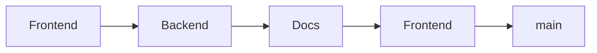
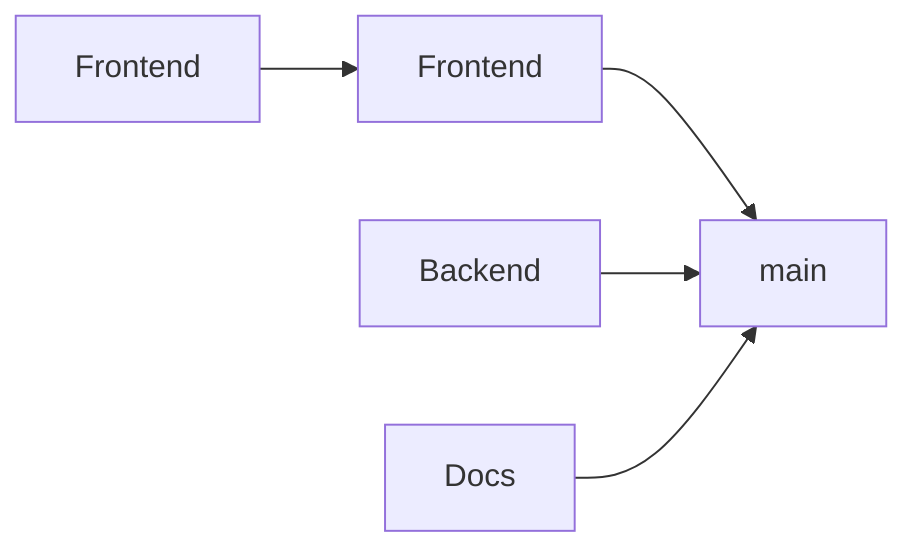

Not all changes conflict with each other. A frontend CSS change and a backend API change can often be tested and merged independently. **Parallel queues** (sometimes called "partitions" or "scopes") allow this:

**Single queue:** all PRs wait in one line, even if they don't conflict.

**Parallel queues:** independent scopes merge simultaneously.

## How It Works

With parallel queues:
- PRs in the **same scope** are tested against each other (strict ordering)
- PRs in **different scopes** can merge independently (parallel)
- You define scopes based on your codebase (by directory, by team, by project)

This dramatically increases throughput for large monorepos where most changes don't interact.

## Defining Scopes

Common approaches to defining parallel queues:

- **By directory** — group by file paths (`src/frontend/`, `src/backend/`, `docs/`)
- **By team** — each team owns their scope and merge pace
- **By build target** — particularly useful with monorepo build tools like Bazel, Rush, Nx, Turborepo, or Pants that understand dependency graphs

## Handling Cross-Scope Changes

What happens when a PR touches multiple scopes?

| Strategy | Behavior |
|----------|----------|
| **Union** | PR joins all affected queues, must pass all |
| **Primary scope** | PR joins only its primary/largest scope |
| **Global queue** | Cross-scope PRs go to a single global queue |

## Benefits

1. **Higher throughput** - independent changes don't block each other
2. **Faster merges** - smaller queues = shorter wait times
3. **Team autonomy** - teams control their own merge pace
4. **Fault isolation** - one team's failures don't affect others

## Considerations

- Scope definitions need maintenance as codebase evolves
- Cross-cutting changes may still create bottlenecks
- Requires clear code ownership boundaries
