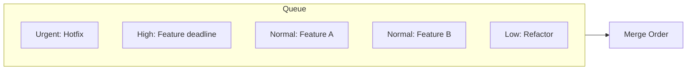
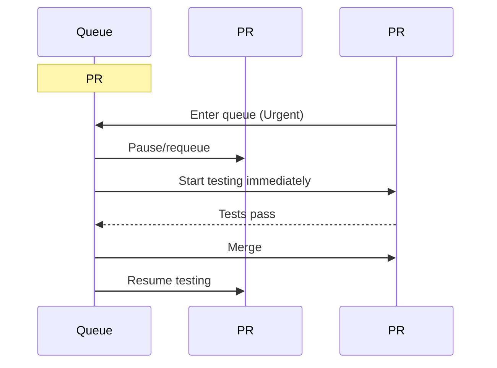

Not all PRs are equally urgent. Merge queues support priority levels:

A critical security fix can jump ahead of routine changes without completely disrupting the queue.

## Priority Levels

Typical priority tiers:

| Priority | Use Case | Example |
|----------|----------|---------|
| **Urgent/Critical** | Production incidents, security fixes | Hotfix for data breach |
| **High** | Time-sensitive features, blockers | Release deadline feature |
| **Normal** | Regular development work | Most PRs |
| **Low** | Non-urgent improvements | Refactoring, tech debt |

## How Priority Affects the Queue

When a high-priority PR enters:

1. It's placed ahead of lower-priority PRs
2. Lower-priority PRs may be re-queued to test behind it
3. The high-priority PR gets tested first

## Negative Priority

Some systems support **negative priority** to explicitly deprioritize certain PRs:

- Large refactors that should merge during quiet periods
- Dependency updates that can wait
- Non-blocking improvements

These PRs only merge when there's nothing else in the queue.

## Setting Priority

Priority can be set via:
- **Labels** - `priority:urgent`, `priority:low`
- **Commands** - `/priority high`
- **Rules** - Auto-assign based on files changed or PR author
- **API** - Programmatic priority management

## Best Practices

1. **Reserve urgent for true emergencies** - overuse defeats the purpose
2. **Document what qualifies for each level** - avoid priority inflation
3. **Monitor priority distribution** - too many high-priority PRs indicates a problem
4. **Consider priority decay** - PRs waiting too long could auto-promote
