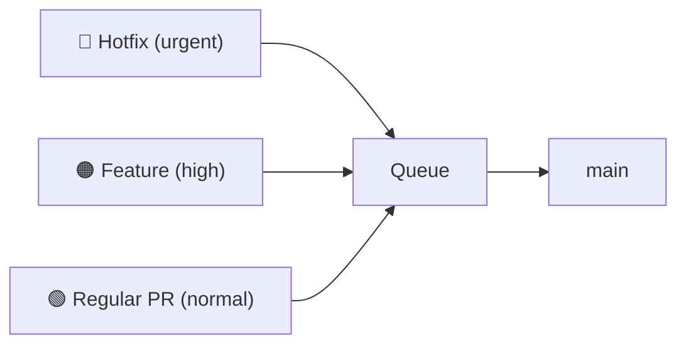
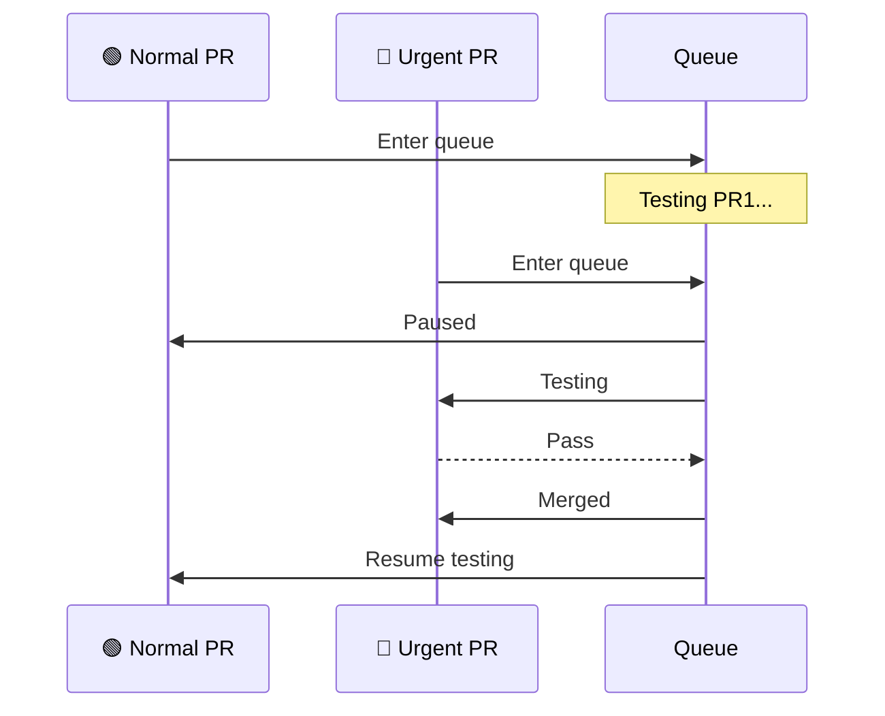

Not all PRs are equally urgent. A critical security fix can jump ahead of routine changes:

## Priority Levels

Typical priority tiers:

| Priority | Use Case | Example |
|----------|----------|---------|
| **Urgent/Critical** | Production incidents, security fixes | Hotfix for data breach |
| **High** | Time-sensitive features, blockers | Release deadline feature |
| **Normal** | Regular development work | Most PRs |
| **Low** | Non-urgent improvements | Refactoring, tech debt |

## How Priority Affects the Queue

When a high-priority PR enters:

1. It's placed ahead of lower-priority PRs
2. Lower-priority PRs may be re-queued to test behind it
3. The high-priority PR gets tested first

## Setting Priority

Priority can be set via:
- **Rules** — automatically based on labels, files changed, or PR author
- **Commands** — manually via PR comments

## In Practice

It's 3 PM on a Wednesday. Your merge queue has 8 PRs testing. A security vulnerability is reported and an engineer has a hotfix ready in 15 minutes.

Without priority management, the hotfix waits behind all 8 PRs. With a 20-minute CI pipeline, that's potentially 40+ minutes before the fix even starts testing.

With priority management, the hotfix enters the queue at position 1. The queue pauses lower-priority testing, tests the hotfix against `main`, and merges it within 20 minutes. The other 8 PRs re-queue behind the fix and continue normally.

The difference: 20 minutes to production vs. 60+ minutes. For a security fix, that gap matters.

## Avoiding Queue Starvation

A common failure mode: teams start using "high priority" for routine work, and normal-priority PRs never merge. This is **queue starvation**.

Mitigations:

- **Priority decay** — PRs waiting longer than a threshold automatically promote. A normal PR waiting 2 hours becomes high priority.
- **Reserved slots** — ensure at least N% of queue capacity serves normal-priority PRs, regardless of how many high-priority PRs are waiting.
- **Priority budgets** — each team gets a limited number of high-priority slots per week. Once exhausted, all PRs enter at normal priority.
- **Monitoring** — track the distribution of priority levels over time. If more than 20% of PRs are "high priority," the system is being gamed.

## Best Practices

1. **Reserve urgent for true emergencies** — overuse defeats the purpose
2. **Document what qualifies for each level** — avoid priority inflation
3. **Monitor priority distribution** — too many high-priority PRs indicates a problem
4. **Consider priority decay** — PRs waiting too long could auto-promote

## Related Features

- **[Speculative Checks](/features/speculative-merging/)** — high-priority PRs speculate from the front
- **[Freshness Policies](/features/freshness-policies/)** — urgent PRs may need stricter freshness
- **[Two-Step CI](/features/two-step-ci/)** — consider fast-tracking queue CI for emergency hotfixes
