Instead of waiting for each PR to complete, the queue can **test multiple PRs in parallel by assuming earlier PRs will pass**.

## Sequential vs Speculative

**Sequential approach** — each PR waits for the previous one to finish:

```mermaid
gantt
    title Sequential: 90 minutes total
    dateFormat X
    axisFormat %s

    section Queue
    PR #1 (test against main)           :s1, 0, 30
    PR #2 (test against main+PR1)       :s2, 30, 60
    PR #3 (test against main+PR1+PR2)   :s3, 60, 90
```

**Speculative approach** — all PRs test in parallel, assuming earlier ones will pass:

```mermaid
gantt
    title Speculative: 30 minutes total
    dateFormat X
    axisFormat %s

    section Queue
    PR #1 (test against main)           :p1, 0, 30
    PR #2 (test against main+PR1)       :p2, 0, 30
    PR #3 (test against main+PR1+PR2)   :p3, 0, 30
```

**3x faster!**

## How It Works

1. PR #1 enters the queue → test against `main`
2. PR #2 enters the queue → test against `main + PR #1` (assuming #1 will pass)
3. PR #3 enters the queue → test against `main + PR #1 + PR #2` (assuming both will pass)

All three tests run simultaneously.

## When Speculation Fails

If PR #1 fails, the speculation for PRs #2 and #3 was wrong. They were tested against a state that will never exist.

**What happens:**
- PR #1 is removed from the queue
- PRs #2 and #3 are automatically re-queued
- PR #2 now tests against `main` (not `main + PR #1`)
- PR #3 tests against `main + PR #2`

The speculation was wrong, but we only lost the time for one CI run. On average, this is still much faster than sequential testing.

## Speculation Depth

You can limit how far ahead the queue speculates:

| Depth | Behavior |
|-------|----------|
| 1 | No speculation (sequential) |
| 3 | Test up to 3 PRs ahead |
| Unlimited | Test all PRs in parallel |

Higher depth = more parallelism but more wasted CI if early PRs fail.

## Choosing Your Depth

The right speculation depth depends on two factors: your queue failure rate and your CI resource budget.

**Low failure rate (<2%):** Use unlimited or high depth. Speculations almost always succeed, so you get maximum parallelism with minimal waste.

**Medium failure rate (2-5%):** Depth of 3-5 works well. You get significant speedup while limiting cascade failures to a manageable scope.

**High failure rate (>5%):** Keep depth at 2-3, and invest in stabilizing your test suite first. High failure rates cause frequent cascade restarts that can actually make the queue *slower* than sequential processing.

A useful metric to track: **speculation hit rate** — the percentage of speculative runs that don't need to restart. If your hit rate drops below 80%, consider reducing depth or fixing test stability.

## Cascade Failures

When speculation fails, the impact depends on *which* PR fails:

- **PR #1 fails** → PRs #2, #3, #4 all restart (tested against a state that will never exist)
- **PR #3 fails** → PRs #1 and #2 merge normally, only PR #4 restarts

A failure early in the queue causes more wasted work than a failure late in the queue. This is why most merge queues run a [lightweight PR CI check](/features/two-step-ci/) before PRs even enter the queue — catching obvious failures early reduces costly cascade restarts.

## Combining with Batching

Speculative checks and [batching](/features/batching/) work well together:

:::tip[Maximize throughput]
- **Speculative checks** reduce latency by testing in parallel
- **Batching** reduces CI cost by grouping PRs per run

Example: speculatively test batch [1-3] and batch [4-6] in parallel. You get the speed of speculation with the efficiency of batching.
:::

## Best For

- Teams with high PR volume — see [High-Velocity Teams](/use-cases/high-velocity-teams/)
- Codebases with low failure rates in the queue
- When CI resources are not a constraint — see [Long CI Pipelines](/use-cases/long-ci-pipelines/) for constrained environments

## Related Features

- **[Batching](/features/batching/)** — combine with speculation for maximum throughput
- **[Two-Step CI](/features/two-step-ci/)** — pre-validate PRs to improve speculation hit rate
- **[Priority Management](/features/priority-management/)** — high-priority PRs speculate from the front of the queue
