Instead of waiting for each PR to complete, the queue can **test multiple PRs in parallel by assuming earlier PRs will pass**.

## Sequential vs Speculative

**Sequential approach** — each PR waits for the previous one to finish:

```mermaid
gantt
    title Sequential: 90 minutes total
    dateFormat X
    axisFormat %s

    section Queue
    PR #1 (test against main)           :s1, 0, 30
    PR #2 (test against main+PR1)       :s2, 30, 60
    PR #3 (test against main+PR1+PR2)   :s3, 60, 90
```

**Speculative approach** — all PRs test in parallel, assuming earlier ones will pass:

```mermaid
gantt
    title Speculative: 30 minutes total
    dateFormat X
    axisFormat %s

    section Queue
    PR #1 (test against main)           :p1, 0, 30
    PR #2 (test against main+PR1)       :p2, 0, 30
    PR #3 (test against main+PR1+PR2)   :p3, 0, 30
```

**3x faster!**

## How It Works

1. PR #1 enters the queue → test against `main`
2. PR #2 enters the queue → test against `main + PR #1` (assuming #1 will pass)
3. PR #3 enters the queue → test against `main + PR #1 + PR #2` (assuming both will pass)

All three tests run simultaneously.

## When Speculation Fails

If PR #1 fails, the speculation for PRs #2 and #3 was wrong. They were tested against a state that will never exist.

**What happens:**
- PR #1 is removed from the queue
- PRs #2 and #3 are automatically re-queued
- PR #2 now tests against `main` (not `main + PR #1`)
- PR #3 tests against `main + PR #2`

The speculation was wrong, but we only lost the time for one CI run. On average, this is still much faster than sequential testing.

## Speculation Depth

You can limit how far ahead the queue speculates:

| Depth | Behavior |
|-------|----------|
| 1 | No speculation (sequential) |
| 3 | Test up to 3 PRs ahead |
| Unlimited | Test all PRs in parallel |

Higher depth = more parallelism but more wasted CI if early PRs fail.

## Combining with Batching

Speculative checks and [batching](/features/batching/) work well together:

:::tip[Maximize throughput]
- **Speculative checks** reduce latency by testing in parallel
- **Batching** reduces CI cost by grouping PRs per run

Example: speculatively test batch [1-3] and batch [4-6] in parallel. You get the speed of speculation with the efficiency of batching.
:::

## Best For

- Teams with high PR volume
- Codebases with low failure rates in the queue
- When CI resources are not a constraint
