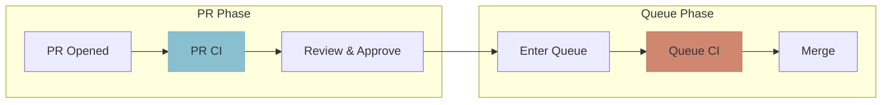

Most teams already run CI on pull requests. A merge queue adds a **second validation step** that runs when the PR enters the queue:

## Why Two Steps?

- **PR CI** catches obvious issues quickly, giving fast feedback to developers
- **Queue CI** validates against the true merge target, catching integration issues

The queue CI can run a different (often more comprehensive) test suite than PR CI. Some teams run fast unit tests on PRs and full integration tests in the queue.

## Common Configurations

| PR CI | Queue CI | Use Case |
|-------|----------|----------|
| Unit tests only | Full test suite | Fast PR feedback, thorough queue validation |
| Lint + type check | All tests + E2E | Catch formatting issues early, integration last |
| Affected tests only | Full test suite | Scale PR CI for monorepos |
| Same as queue | Same as PR | Simple setup, consistent validation |

## Benefits

1. **Faster PR feedback** - developers get quick signal on obvious issues
2. **Comprehensive merge validation** - full testing before code lands
3. **Resource optimization** - expensive tests only run when PR is ready to merge
4. **Separation of concerns** - different test suites for different purposes
