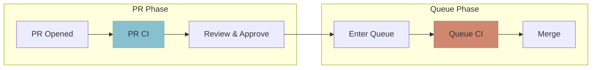

Most teams already run CI on pull requests. A merge queue adds a **second validation step** that runs when the PR enters the queue:

## Why Two Steps?

- **PR CI** catches obvious issues quickly, giving fast feedback to developers
- **Queue CI** validates against the true merge target, catching integration issues

The queue CI can run a different (often more comprehensive) test suite than PR CI. Some teams run fast unit tests on PRs and full integration tests in the queue.

## Common Configurations

| PR CI | Queue CI | Use Case |
|-------|----------|----------|
| Unit tests only | Full test suite | Fast PR feedback, thorough queue validation |
| Lint + type check | All tests + E2E | Catch formatting issues early, integration last |
| Affected tests only | Full test suite | Scale PR CI for monorepos |
| Same as queue | Same as PR | Simple setup, consistent validation |

## Catching What PR CI Misses

Consider two PRs that both pass PR CI independently:

- **PR #1** adds a new required parameter to a shared API endpoint
- **PR #2** calls that same endpoint without the new parameter

Both PRs pass their own CI — they were tested against the current `main` where neither change existed yet. But when PR #1 merges first, PR #2 is now broken.

Queue CI catches this. When PR #2 enters the queue, it's tested against `main + PR #1`, where the API signature has already changed. The test fails *before* reaching main.

This is the kind of [semantic conflict](/introduction/what-is-a-merge-queue/) that only two-step CI can reliably prevent. PR CI tells developers "your change works in isolation." Queue CI answers a different question: "will your change work when it actually lands?"

## Optimizing CI Costs

Two-step CI isn't just about safety — it's a cost optimization strategy. Expensive tests (E2E, browser tests, load tests) only run when a PR has already passed review and is ready to merge.

For a team with 50 PRs per week where only 30 pass review:

- **Without two-step:** 50 full CI runs
- **With two-step:** 50 lightweight PR CI runs + 30 full queue CI runs

The savings compound when full CI involves spinning up infrastructure like databases, browser farms, or staging environments.

## Benefits

1. **Faster PR feedback** — developers get quick signal on obvious issues
2. **Comprehensive merge validation** — full testing before code lands
3. **Resource optimization** — expensive tests only run when PR is ready to merge
4. **Separation of concerns** — different test suites for different purposes

## Related Features

- **[Batching](/features/batching/)** — combine queue CI runs for even more efficiency
- **[Freshness Policies](/features/freshness-policies/)** — control how up-to-date queue tests must be
- **[Speculative Checks](/features/speculative-merging/)** — run queue CI for multiple PRs in parallel
