This page explains the internal mechanics of a merge queue — how PRs flow through it, how test branches are created, and how the queue coordinates with your CI system.

## The PR Lifecycle

A pull request goes through several stages in a merge queue:

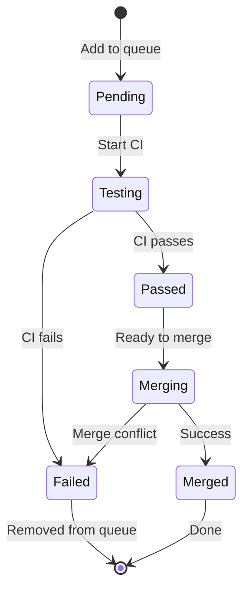

### Stage 1: Entering the Queue

When a PR is added to the merge queue, the queue:

1. **Validates eligibility** — Is the PR approved? Are required checks passing?
2. **Assigns position** — Based on priority and arrival time
3. **Records the base** — Captures the current state of the target branch

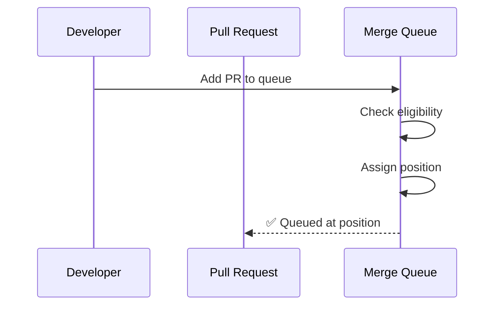

### Stage 2: Creating the Test Branch

The merge queue creates a **temporary branch** that represents "what main will look like after this PR merges." This is the key insight that makes merge queues work.

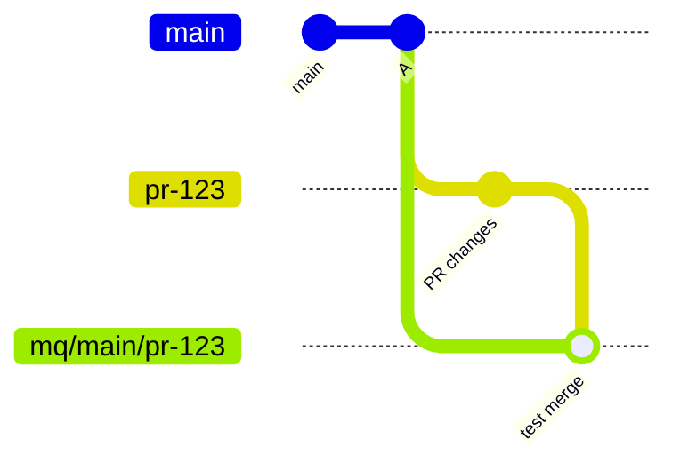

The test branch (`mq/main/pr-123`) contains:
- All commits from `main`
- All commits from PRs ahead in the queue (if using [speculative merging](/features/speculative-merging/))
- The PR's changes, merged in

### Stage 3: Running CI

The merge queue triggers CI on the test branch. This is often called "queue CI" to distinguish it from the CI that runs on the PR branch itself.

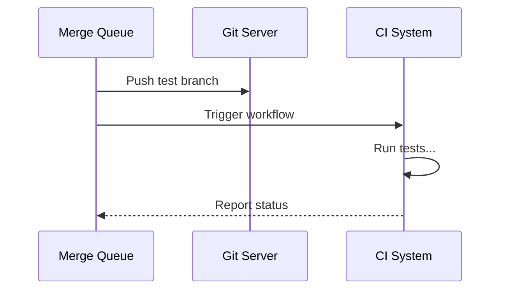

The queue monitors CI status and waits for all required checks to complete.

### Stage 4: Merging or Failing

**If CI passes:**

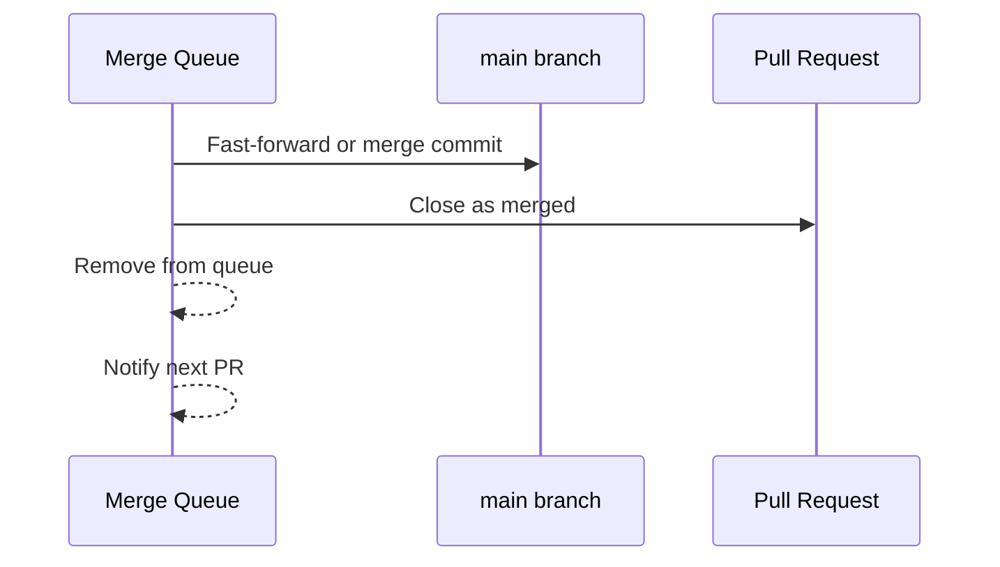

**If CI fails:**

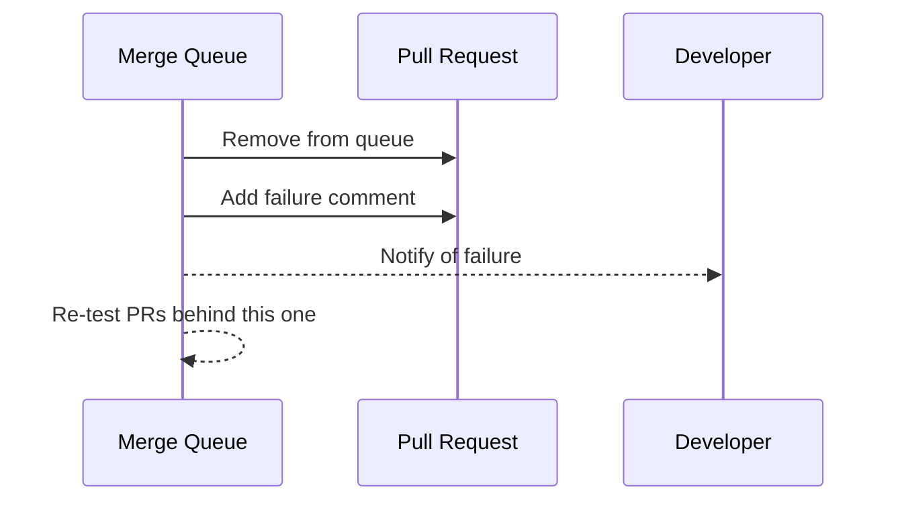

## Queue Dynamics

Understanding how the queue manages multiple PRs is crucial.

### Queue State

At any moment, the queue contains PRs in various states:

```
Queue State:
┌─────────────────────────────────────────────┐
│  Position  │  PR    │  Status    │  Base    │
├─────────────────────────────────────────────┤
│     1      │  #101  │  Testing   │  abc123  │
│     2      │  #102  │  Testing   │  +#101   │
│     3      │  #103  │  Pending   │  +#102   │
│     4      │  #104  │  Pending   │  +#103   │
└─────────────────────────────────────────────┘
```

Each PR's "base" includes all PRs ahead of it — this is how the queue ensures PRs are tested against the future state of main.

### What Happens When a PR Fails Mid-Queue

When PR #102 fails, the queue must re-evaluate everything behind it:

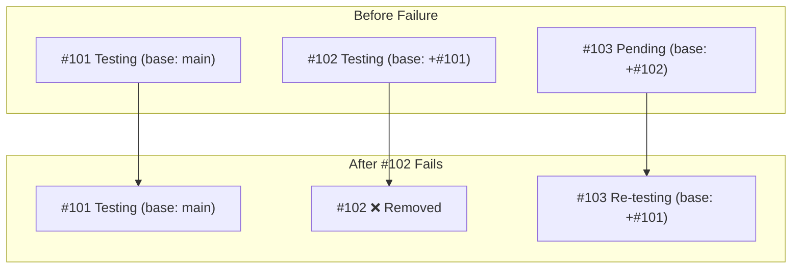

PR #103's test is now invalid — it was tested against a world where #102 existed, but #102 is gone. The queue automatically re-tests #103 with a new base.

## Merge Strategies

When a PR passes CI, the merge queue must integrate it into main. There are several strategies:

### Merge Commit

Creates a merge commit, preserving the full branch history.

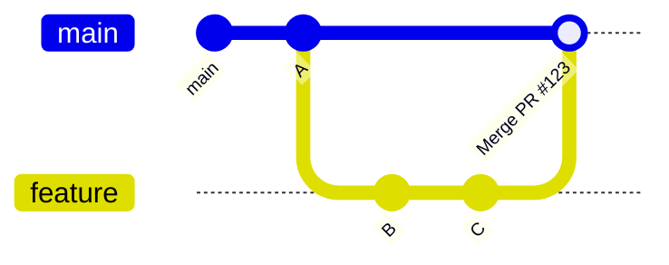

**Pros:** Full history, easy to revert
**Cons:** Cluttered history with merge commits

### Squash and Merge

Combines all PR commits into a single commit.

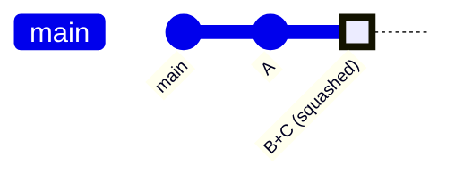

**Pros:** Clean linear history
**Cons:** Loses individual commit granularity

### Rebase and Merge

Replays PR commits on top of main.

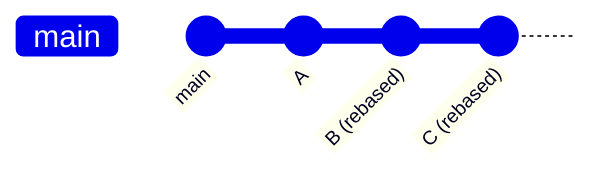

**Pros:** Linear history, preserves commits
**Cons:** Changes commit hashes

### Fast-Forward

Only possible when the test branch is already based on current main. Moves the main pointer forward.

**Pros:** No extra commits
**Cons:** Not always possible

## Coordination with CI

The merge queue needs tight integration with your CI system.

### Required Checks

You configure which CI checks must pass before a PR can merge:

```yaml
# Example configuration
required_checks:
  - "build"
  - "test"
  - "lint"

optional_checks:
  - "coverage"  # Can fail without blocking
```

### CI Triggers

The queue must be able to:
1. **Trigger CI** on the test branch
2. **Receive status updates** when checks complete
3. **Cancel CI** if a PR is removed from the queue

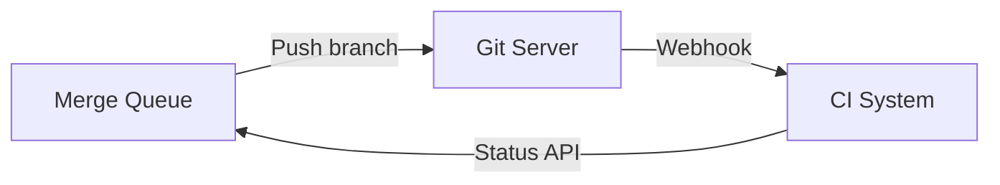

### Handling Flaky Tests

If CI fails due to a flaky test:
- Some queues offer **automatic retry** (1-2 times)
- Some require manual re-queue
- Some track flake rates and adjust behavior

See [Troubleshooting](/best-practices/troubleshooting/) for more on handling flaky tests.

## The Test Branch Lifecycle

Test branches are temporary. Here's their lifecycle:

1. **Created** when PR starts testing
2. **Updated** if base changes (PR ahead merges/fails)
3. **Used for merge** if CI passes
4. **Deleted** after merge or failure

Most merge queues clean up test branches automatically. You'll see branches like:
- `mq/main/pr-123`
- `gh-readonly-queue/main/pr-123-abc1234`
- `mergify/merge-queue/main/pr-123`

## Race Conditions and Edge Cases

### The "ABA" Problem

What if main changes while CI is running?

```
1. PR #1 starts testing against main@A
2. Someone pushes directly to main (now main@B)
3. PR #1's CI passes
4. Should PR #1 merge?
```

Different queues handle this differently:
- **Strict:** Require re-test against new main
- **Optimistic:** Allow merge if no conflicts
- **Configurable:** Based on [freshness policy](/features/freshness-policies/)

### Merge Conflicts

If the test branch has merge conflicts:
- The queue cannot create the test branch
- The PR is removed from the queue
- Developer must resolve conflicts and re-queue

### Force Pushes

If someone force-pushes to a PR while it's in the queue:
- Most queues detect this and re-start testing
- Some queues remove the PR and require re-queue

## Summary

A merge queue works by:

1. **Queuing PRs** in order of priority and arrival
2. **Creating test branches** that represent the future state of main
3. **Running CI** on these test branches
4. **Merging** only if CI passes
5. **Re-testing** downstream PRs when failures occur

This ensures that every commit on main has been tested against the exact state it will merge into — eliminating the "two green PRs make a red main" problem.

Next, explore [whether you need a merge queue](/decision/failure-scenarios/) or dive into specific [features](/features/two-step-ci/).
