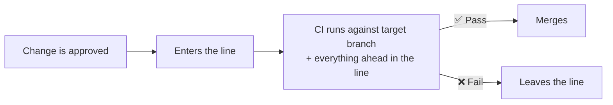
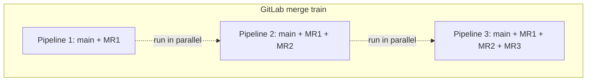
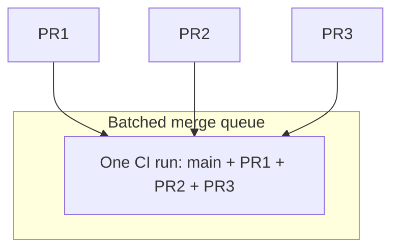
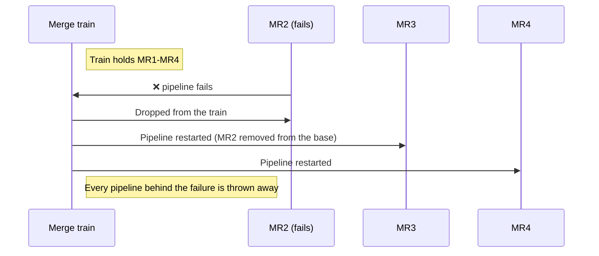

If you have worked on GitLab, you call it a **merge train**. If you have worked on GitHub, you call it a **merge queue**. People assume these are two different techniques. They are not.

Both solve the same race condition: two pull requests that pass CI separately can still break main when they land together. Both solve it the same way, by testing each change against the state main will be in *after* the changes ahead of it have merged.

The name is the biggest difference. The mechanics differ in ways that matter, but they are implementation choices, not different ideas.

## Same Idea, Two Vocabularies

| GitLab | GitHub / generic | What it means |
|---|---|---|
| Merge train | [Merge queue](/introduction/what-is-a-merge-queue/) | The ordered line of changes waiting to land |
| Merge request (MR) | Pull request (PR) | The change itself |
| Merged results pipeline | [Queue CI](/introduction/how-merge-queues-work/) on a test branch | CI run against target branch + the change |
| Added to the train | Queued / enqueued | The change entered the line |
| Dropped from the train | Ejected / dequeued | The change failed and left the line |
| Position in the train | Queue position | Where the change sits in the order |

If you are translating a design doc, a vendor comparison, or a Stack Overflow answer between the two worlds, that table is most of the work.

## The Shared Mechanic

Every merge queue and every merge train does the same three things:

That third step is the whole point. A normal PR pipeline tests your change against main *as it was when you branched*. A queue or train pipeline tests it against main *as it will be when your change lands*. That is what closes the [semantic conflict](/glossary/#semantic-conflict) gap described in [What Happens Without a Merge Queue](/decision/failure-scenarios/).

## Where They Actually Differ

### 1. Trains speculate by default. Queues often batch by default.

GitLab builds one merged results pipeline **per merge request**, and runs them in parallel. The first pipeline tests MR 1 on top of the target branch, the second tests MR 1 + MR 2, the third tests MR 1 + MR 2 + MR 3, and so on. That is [speculative execution](/features/speculative-merging/): each pipeline assumes everything ahead of it will pass.

GitHub's merge queue instead groups queued PRs into a single temporary `gh-readonly-queue/` branch and fires one `merge_group` CI run for the group. You configure the minimum and maximum number of PRs per group. That is [batching](/features/batching/).

Both approaches can be combined, and mature queue implementations do exactly that: batch to cut cost, speculate across batches to cut latency. But the defaults pull in opposite directions, and the defaults are what most teams run.

### 2. That default drives your CI bill

Speculation optimizes for **latency**. Batching optimizes for **cost**.

| 20 changes/day, 30-minute pipeline | One pipeline per change (train-style) | Batches of 4 (queue-style) |
|---|---|---|
| CI runs | 20 | 5 |
| CI minutes | 600 | 150 |
| Time to isolate a failure | Immediate, the failing pipeline names the change | 1-2 extra runs to [bisect](/glossary/#bisection) |

Neither column is wrong. If CI minutes are cheap relative to engineer waiting time, per-change pipelines are the better trade. If your pipeline is expensive, or you are on self-hosted runners with a fixed pool, batching is where the money is. [Long CI Pipelines](/use-cases/long-ci-pipelines/) walks through the arithmetic in more detail.

Note the ceiling: GitLab documents a default maximum of **20 pipelines running in parallel per train**. Past that, merge requests wait for a slot. A team merging faster than 20 changes per pipeline duration will queue behind that limit no matter how much runner capacity it has.

### 3. Failure recovery is the sharpest difference

When a merge train pipeline fails, GitLab drops that merge request from the train and **starts new pipelines for every merge request queued behind it**. The failed pipeline cannot be retried, because its merged result is now stale by definition.

That is the cost of speculation: one failure invalidates all the work built on top of it. A batched queue absorbs the same failure differently. It bisects the failing batch, ejects the culprit, and lets the innocent changes in the batch continue.

The practical consequence is the same one covered in [Prerequisites](/decision/prerequisites/): **flaky tests are more expensive on a train than almost anywhere else.** A 5% flake rate on a train of 10 does not cost you one pipeline. It costs you that pipeline plus every pipeline behind it, repeatedly.

### 4. Trains have a tier and a setup requirement

Merge trains are a GitLab **Premium and Ultimate** feature. Before you can turn them on you need:

- Merge request pipelines configured in `.gitlab-ci.yml`
- **Merged results pipelines** enabled on the project
- The Maintainer role
- Permission to merge or push to the target branch
- A GitLab-hosted repository, not an external mirror

The merged results prerequisite trips up teams most often. If your pipeline runs on the source branch only, turning on merge trains does nothing useful, because the pipeline is not testing the merged state that the train exists to validate.

### 5. Both have an escape hatch, and both make you pay for it

Urgent changes need a way past the line. GitLab exposes "Merge immediately without restarting the merge train" in project settings, and `skip_merge_train: true` on the merge API. Merge queues expose the equivalent through [priority management](/features/priority-management/) or a direct-merge bypass.

The trade is identical either way. Whatever jumps the line was not tested against the changes it jumped, and on GitHub's queue, queue jumping triggers a full rebuild of the in-progress group. Treat the bypass as an incident tool, not a workflow.

## Side by Side

| | GitLab merge trains | GitHub merge queue |
|---|---|---|
| Default strategy | Speculative, one pipeline per MR | Batched, one CI run per merge group |
| Batching | Not documented as a train mode | Configurable min/max PRs per group |
| Parallelism cap | 20 pipelines per train by default | Build concurrency configurable, 1-100 |
| On failure | MR dropped, all pipelines behind it restarted, no retry | Failing PR removed, remaining PRs regrouped |
| CI cost profile | Scales with change count | Amortized across the group |
| Latency profile | Low, work is already in flight | Higher, changes wait for a group to form |
| Availability | Premium and Ultimate | GitHub-hosted repositories, no wildcard branch protection patterns |
| Prerequisite | Merged results pipelines | `merge_group` event wired into CI |

## Which Vocabulary Should You Use?

Use whichever your platform uses, and know the other. "Merge queue" has become the generic term for the category, including in GitLab-shop conversations, because it describes the data structure rather than the metaphor. "Merge train" is precise inside GitLab and ambiguous outside it.

What matters more than the name: whichever one you run, you are making the same four decisions.

1. Batch or speculate, or both, and at what depth. See [Batching](/features/batching/) and [Speculative Checks](/features/speculative-merging/).
2. How much CI you are willing to spend per merge.
3. What happens to the changes behind a failure.
4. How stale a change is allowed to get before the queue re-tests it. See [Freshness Policies](/features/freshness-policies/).

The platform picks defaults for you. It does not pick the right answer for your team.

## Next Steps

- [What is a Merge Queue?](/introduction/what-is-a-merge-queue/) - the core concept, platform-neutral
- [How Merge Queues Work](/introduction/how-merge-queues-work/) - the lifecycle in detail
- [Batching](/features/batching/) and [Speculative Checks](/features/speculative-merging/) - the two strategies compared above
- [Prerequisites](/decision/prerequisites/) - why flake rate decides how much either strategy costs you
- [Glossary](/glossary/) - the full vocabulary

## Sources

- [Merge trains, GitLab Docs](https://docs.gitlab.com/ci/pipelines/merge_trains/)
- [Merged results pipelines, GitLab Docs](https://docs.gitlab.com/ci/pipelines/merged_results_pipelines/)
- [Managing a merge queue, GitHub Docs](https://docs.github.com/en/repositories/configuring-branches-and-merges-in-your-repository/configuring-pull-request-merges/managing-a-merge-queue)
