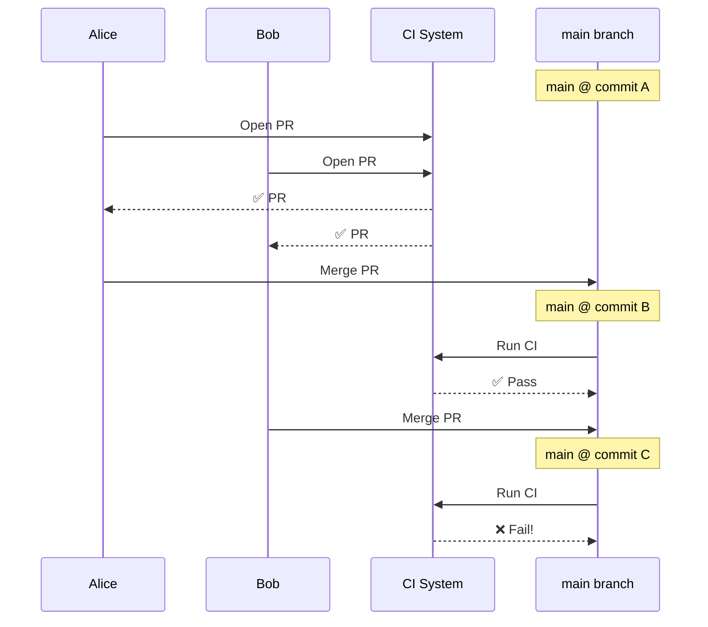
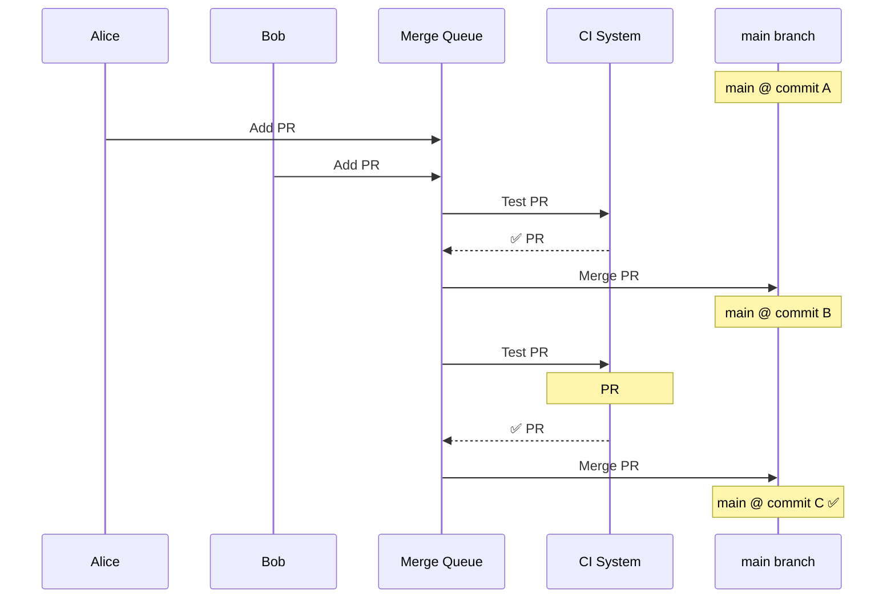
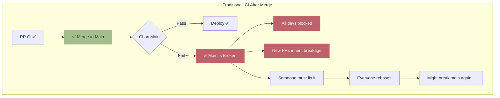
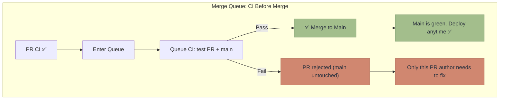

A merge queue is an automation layer that controls how pull requests get integrated into your main branch. It sits between "PR approved" and "PR merged," ensuring that changes are validated, optimized, and safely landed.

While the simplest merge queues just serialize merges, modern merge queues are sophisticated systems that can **validate changes against future main state**, **batch PRs for efficiency**, **run dedicated CI pipelines**, and **parallelize testing across independent parts of your codebase**.

## The Core Problem

Without a merge queue, two developers can unknowingly break each other's code:



Both PRs passed CI individually. But **PR #2 was never tested with PR #1's changes**. The combination is broken, and now main is red.

### A Concrete Example

Here's how this plays out in practice. Your codebase has a utility module:

```python
# utils.py
def calculate_tax(amount):
    return amount * 0.2
```

**Alice** is refactoring. She renames `utils.py` to `helpers.py` and updates all existing imports:

```python
# helpers.py (renamed from utils.py)
def calculate_tax(amount):
    return amount * 0.2
```

**Bob** is building a new feature. He adds code that imports from `utils`:

```python
# checkout.py (new file)
from utils import calculate_tax

def process_order(total):
    tax = calculate_tax(total)
    return total + tax
```

Both PRs pass CI:
- Alice's PR: All tests pass—she updated every import
- Bob's PR: All tests pass—`utils.py` still exists on his branch

There's no merge conflict—they touched different files. Git happily merges both.

But now `checkout.py` imports from `utils`, which no longer exists. **Main is broken.**

```
ModuleNotFoundError: No module named 'utils'
```

This isn't a rare edge case. It happens constantly with:
- Renamed functions, classes, or modules
- Deleted code that another PR depends on
- Changed function signatures
- Modified shared configuration

### The Scale Problem

This isn't theoretical. On active repositories:

- A team merging **5 PRs/day** with 30-minute CI will have PRs go stale regularly
- A team merging **20+ PRs/day** will see main break multiple times per week
- Monorepos with **100+ daily merges** face near-constant instability without automation

Manual solutions ("just rebase before merging") don't scale. They create bottlenecks, frustrate developers, and still fail under concurrent merges.

## What a Merge Queue Does

A merge queue tests each PR against its **actual merge target**—including all PRs ahead of it:



The key insight: **test the PR against what main will look like after the merge, not what it looked like when the PR was created.**

## The Paradigm Shift: CI Before Merge, Not After

Traditional workflows run final CI **after** merging to main:



The problem: by the time you discover the failure, **main is already broken**. The damage cascades:

1. **Deployments stop** - you can't ship until main is fixed
2. **All developers are blocked** - no one can merge until the fix lands
3. **New PRs inherit the breakage** - any PR based on broken main will also fail CI
4. **Everyone must rebase** - after the fix, every in-flight PR needs to rebase
5. **The cycle can repeat** - rebasing and re-merging might break main again

A merge queue flips this: final CI runs **before** the merge:



The queue CI tests the PR **as if it were already merged** with current main. If it passes, the merge is guaranteed safe. If it fails, the PR is rejected and **main is never touched**.

This means:
- **Main is always green** - broken code never lands
- **Main is always deployable** - you can deploy with confidence at any time
- **Failures are isolated** - only the PR author is affected, not the whole team

This is the fundamental value of a merge queue: it makes "broken main" impossible by construction.

:::tip[Want to learn more?]
See [What Happens Without a Merge Queue](/decision/failure-scenarios/) for a detailed breakdown of the failure modes and their costs.
:::

## Core Capabilities

Modern merge queues provide several layers of value beyond basic serialization:

- **[Two-Step CI](/features/two-step-ci/)** — Separate PR validation from queue validation
- **[Batching](/features/batching/)** — Test multiple PRs together for efficiency
- **[Speculative Merging](/features/speculative-merging/)** — Parallelize testing by assuming success
- **[Parallel Queues](/features/parallel-queues/)** — Independent queues for non-conflicting changes
- **[Freshness Policies](/features/freshness-policies/)** — Balance safety and throughput
- **[Priority Management](/features/priority-management/)** — Urgent PRs can jump the queue
- **[Automatic Rollback](/features/automatic-rollback/)** — Revert on post-merge failure
- **[Affected Targets](/features/affected-targets/)** — Selective testing with build graphs

Explore each feature in detail in the [Features](/features/two-step-ci/) section.

## Summary

A merge queue is more than "automated merging." It's a system that:

1. **Guarantees main branch stability** by testing PRs against their actual merge target
2. **Shifts CI left** — validation happens before merge, not after
3. **Maximizes throughput** through batching, speculation, and parallelism
4. **Scales to large codebases** with scoped validation and selective testing
5. **Handles real-world complexity** with priority management and rollback

The next section covers [how merge queues work](/introduction/how-merge-queues-work/) in more technical detail.
