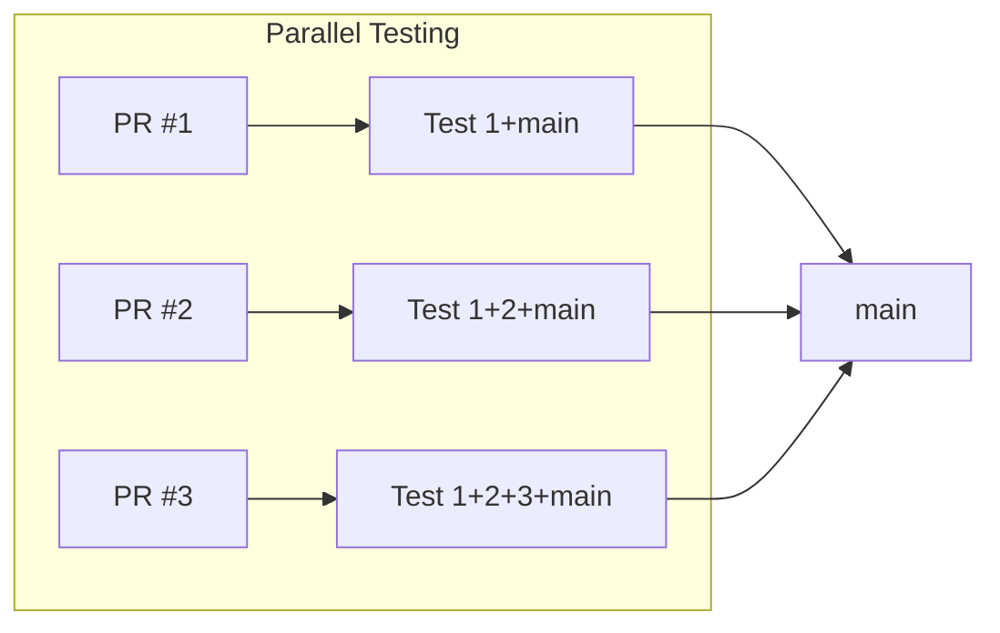

When you're merging 20, 50, or 100+ PRs per day, a merge queue isn't optional—it's infrastructure. At this velocity, manual coordination breaks down and broken main becomes a daily occurrence.

## The Math of High Velocity

With 15-minute CI and a simple serial queue:

| PRs/day | Queue capacity | Result |
|---------|----------------|--------|
| 20 | 32 (8hr ÷ 15min) | Manageable |
| 50 | 32 | PRs back up |
| 100 | 32 | Impossible |

Without optimization, high-velocity teams hit a ceiling. PRs wait hours. Engineers lose context. Frustration spikes.

## Breaking the Bottleneck

High-velocity teams need every optimization available:

### 1. Speculative Checks

[Speculative checks](/features/speculative-merging/) test multiple PRs in parallel by assuming earlier ones will pass:



Three PRs merge in the time of one. Throughput triples.

### 2. Batching

[Batching](/features/batching/) groups PRs into a single CI run:

```
Batch: PR #1, #2, #3, #4, #5
→ One CI run for 5 PRs
→ 80% CI cost reduction
```

Fewer CI runs means lower costs and faster feedback for everyone.

### 3. Two-Step CI

[Two-step CI](/features/two-step-ci/) splits validation:

- **PR CI**: Fast checks (lint, unit tests, build)
- **Queue CI**: Thorough checks (integration, E2E)

This keeps PR feedback fast while the queue handles comprehensive testing.

### 4. Priority Lanes

Not all PRs are equal. [Priority management](/features/priority-management/) lets urgent changes skip ahead:

- Hotfixes merge immediately
- Feature work follows normal flow
- Docs and chores can wait

## Measuring Queue Health

Track these metrics to know if your queue is keeping up:

| Metric | Healthy | Warning | Critical |
|--------|---------|---------|----------|
| **Median wait time** | < 30 min | 30-60 min | > 60 min |
| **P95 wait time** | < 2 hr | 2-4 hr | > 4 hr |
| **Queue depth** | < 10 PRs | 10-20 PRs | > 20 PRs |
| **Failure rate** | < 5% | 5-15% | > 15% |

When metrics trend toward warning, investigate before they hit critical.

## Common Patterns

### Small, Focused PRs

High-velocity teams ship small PRs:
- Easier to review
- Faster CI
- Lower conflict risk
- Simpler rollback

A team shipping 50 small PRs moves faster than one shipping 10 large PRs.

### Trunk-Based Development

Most high-velocity teams practice [trunk-based development](/use-cases/trunk-based-development/):
- Short-lived branches (hours, not days)
- Frequent integration
- Feature flags for incomplete work

The merge queue makes this safe by catching integration issues before they land.

### Automated Everything

At high velocity, manual steps become bottlenecks:
- Auto-merge when approved and CI passes
- Auto-assign reviewers
- Auto-label by file paths
- Auto-add to queue on approval

The merge queue is one piece of a fully automated pipeline.

## Scaling Signals

You need to optimize when:

- **Wait times creep up** — PRs taking longer to merge each month
- **Engineers complain** — "The queue is always full"
- **Workarounds appear** — People merging directly to main "just this once"
- **CI costs spike** — Full test suite running for every PR

Address early. Small delays compound into large productivity losses.

## Example: Scaling from 20 to 100 PRs/day

**At 20 PRs/day:**
- Serial queue, 15-minute CI
- Comfortable margin

**At 40 PRs/day:**
- Add batching (batch size 3-4)
- Add speculative checks (depth 2)
- Still one queue

**At 70 PRs/day:**
- Split into parallel queues by area
- Increase speculation depth
- Add two-step CI

**At 100+ PRs/day:**
- Per-team queues
- Aggressive batching
- Priority lanes
- Real-time queue monitoring

## Key Takeaways

1. **Do the math** — Know your theoretical throughput vs. actual PR volume
2. **Use every lever** — Batching, speculation, parallelism, priorities
3. **Measure constantly** — Wait time is your key metric
4. **Optimize proactively** — Fix slowdowns before engineers feel them
5. **Automate the pipeline** — The queue is just one piece
