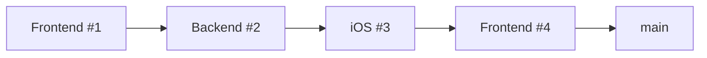
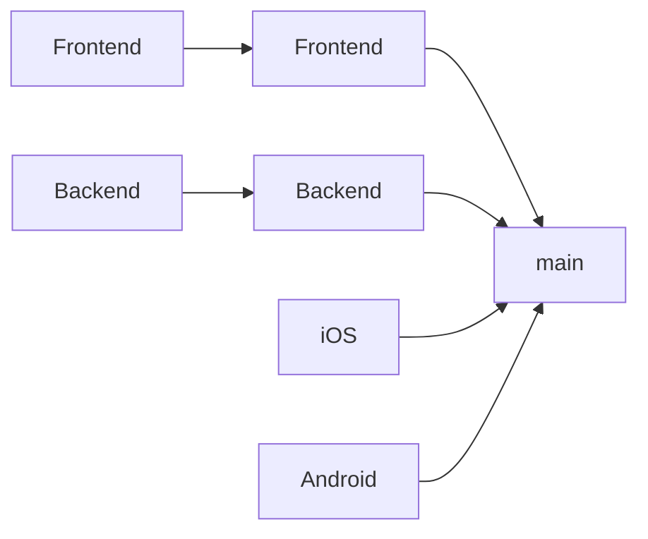

Monorepos amplify every problem a merge queue solves. More developers, more PRs, more potential conflicts, more CI runs. A single queue becomes a bottleneck. Without one, main breaks constantly.

## Why Monorepos Need Merge Queues

In a monorepo, the math works against you:

| Metric | Polyrepo (10 repos) | Monorepo |
|--------|---------------------|----------|
| PRs per day | 5 per repo = 50 total | 50 in one repo |
| Conflict potential | Low (isolated repos) | High (shared codebase) |
| "Main is broken" impact | One team blocked | Everyone blocked |
| CI cost | Scales per repo | Full suite every PR? |

A broken main in a monorepo blocks *everyone*. The pressure to keep it green is much higher.

## The Single Queue Problem

A naive merge queue serializes all PRs:



With 20-minute CI and 50 PRs/day, you're underwater. PRs queue for hours. Engineers context-switch. Frustration mounts.

## The Solution: Parallel Queues

[Parallel queues](/features/parallel-queues/) let independent changes merge simultaneously:



Each team gets their own queue. Frontend changes don't block backend. iOS doesn't wait for Android.

### Defining Queue Boundaries

Common approaches:

| Approach | Works well when | Watch out for |
|----------|-----------------|---------------|
| **By directory** | Clear folder structure (`apps/`, `libs/`) | Shared code in `/common` |
| **By team** | Strong code ownership | Cross-team changes |
| **By build target** | Using Bazel, Nx, Turborepo | Requires build tool setup |
| **By CI config** | Different test suites per area | Config drift |

Most teams start with directory-based rules and evolve from there.

## Handling Shared Code

The tricky part: what happens when a PR touches code used by multiple areas?

```
src/
├── apps/
│   ├── frontend/    → Frontend queue
│   ├── backend/     → Backend queue
│   └── mobile/      → Mobile queue
└── libs/
    └── common/      → ??? which queue ???
```

The standard approach: **the PR joins all affected queues and must pass all of them**. A change to `libs/common` that's used by frontend and backend joins both queues, runs both CI suites, and only merges when both pass.

## CI Optimization

Running the full test suite for every PR defeats the purpose. Monorepo-aware CI helps:

- **Build tools** (Bazel, Nx, Turborepo, Pants) can determine affected tests
- **Per-queue CI** — Each queue runs only its relevant tests
- **Two-step CI** — Fast checks on PR, thorough checks in queue

Example queue CI strategy:

| Queue | CI Runs |
|-------|---------|
| Frontend | Frontend unit tests, E2E, build |
| Backend | Backend unit tests, API tests, migrations |
| Mobile | Mobile unit tests, build for simulators |
| Global | Full integration suite |

## Scaling Considerations

### Queue Depth Monitoring

Track how long PRs wait in each queue. If one queue consistently backs up:
- Split it into sub-queues
- Investigate slow CI
- Add [batching](/features/batching/) to reduce CI runs

### Cross-Queue Dependencies

Some changes genuinely need coordination. A breaking API change in backend needs frontend updates. Options:

1. **Stack PRs** — Land backend first, then frontend
2. **Feature flags** — Ship both independently, flag controls activation
3. **Atomic PR** — Single PR touching both (goes to global queue)

### Team Autonomy vs. Consistency

Parallel queues give teams autonomy—each controls their merge pace. But this can lead to:
- Different merge standards per team
- Confusion about which queue a PR belongs to
- Orphaned queues when teams restructure

Document queue ownership clearly. Review quarterly.

## Example: Growing Into Parallel Queues

**Stage 1: Single queue**
- Small team, fast CI
- One queue works fine

**Stage 2: CI becomes slow**
- Add [two-step CI](/features/two-step-ci/)
- Add [batching](/features/batching/)
- Still one queue

**Stage 3: Queue backs up despite optimization**
- Split into 2-3 parallel queues by major area
- Keep a global queue for shared code

**Stage 4: Multiple teams, clear ownership**
- Queue per team/domain
- Build-tool integration for automatic assignment
- Metrics dashboard per queue

## Key Takeaways

1. **Monorepos need merge queues** — The alternative is constant broken main
2. **Single queues don't scale** — Parallel queues are essential for large monorepos
3. **Start simple, evolve** — Begin with directories, add sophistication as needed
4. **Shared code is the hard part** — Have a clear strategy before it becomes a bottleneck
5. **Optimize CI per queue** — Don't run everything for every PR
